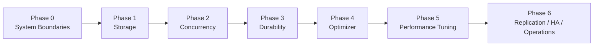

# MySQL Internals Deep Dive

A bilingual, first-principles learning repo for understanding how MySQL works under the hood — from storage and MVCC to crash recovery, optimizer behavior, and production operations.

## Choose your language
- **English:** [en/README.md](en/README.md)
- **Tiếng Việt:** [vi/README.md](vi/README.md)

## What this repo is
- a structured learning path, not a random notes dump
- focused on MySQL internals with production relevance
- organized around a v2 roadmap from system boundaries to replication / HA / ops
- backed by a small Docker lab for hands-on experiments

## Recommended path
1. Pick a language landing page: [English](en/README.md) or [Tiếng Việt](vi/README.md)
2. Read the roadmap
3. Read the first-principles guide
4. Work through the phase README for your current topic
5. Use the production symptom map and cheatsheet as recurring references

## Roadmap at a glance
```text
0. System boundaries
1. Storage
2. Concurrency
3. Durability
4. Optimizer
5. Performance tuning
6. Replication / HA / Operations
```



## Repo structure
```text
.
├── README.md
├── en/
├── vi/
├── roadmap-v2.md
├── first-principles-learning.md
├── production-symptom-map.md
├── cheatsheet.md
├── MIGRATION_NOTES.md
├── docker/
├── phase-0-system-boundaries/
├── phase-1-storage/
├── phase-2-concurrency/
├── phase-3-durability/
├── phase-4-optimizer/
├── phase-5-performance-tuning/
└── phase-6-replication-ha-ops/
```

## Quick links
- English roadmap: [en/roadmap-v2.md](en/roadmap-v2.md)
- Vietnamese roadmap: [vi/roadmap-v2.md](vi/roadmap-v2.md)
- English first-principles guide: [en/first-principles-learning.md](en/first-principles-learning.md)
- Vietnamese first-principles guide: [vi/first-principles-learning.md](vi/first-principles-learning.md)
- Docker lab: [docker/README.md](docker/README.md)
- Publish-readiness review: [review/publish-readiness-review.md](review/publish-readiness-review.md)

## Lab environment
MySQL 8.4.3 runs in Docker with `performance_schema` and InnoDB monitors enabled.

```bash
cd docker && docker compose up -d
docker exec -it mysql-lab mysql -u root -prootpass lab
```

See [docker/README.md](docker/README.md) for setup details.

## Scope note
- The bilingual split currently covers repo-level docs and phase README navigation.
- The deeper reading ladder files (`read-1min`, `read-5min`, `read-10min`, `read-full`) still live in the root phase directories.
- This keeps the repo practical and publishable without a large disruptive rewrite.
