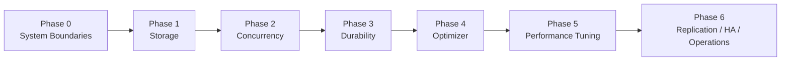

# MySQL Internals Deep Dive

A first-principles, hands-on learning repo for deeply understanding MySQL internals with production and architect-level relevance.

## Canonical entry points

Start in this order:
1. [roadmap-v2.md](roadmap-v2.md)
2. [first-principles-learning.md](first-principles-learning.md)
3. current phase README
4. [production-symptom-map.md](production-symptom-map.md)
5. [cheatsheet.md](cheatsheet.md)

## Roadmap v2

```text
0. System boundaries
1. Storage
2. Concurrency
3. Durability
4. Optimizer
5. Performance tuning
6. Replication / HA / Operations
```



## Why v2

The v2 roadmap makes the learning path better aligned with real backend production work:
- makes **concurrency / MVCC / locking** a first-class phase
- separates **optimizer internals** from **performance diagnosis and tuning**
- adds explicit bridges from internals to **production symptoms** and **operational decisions**

## Repo structure

```text
.
├── README.md
├── roadmap-v2.md
├── first-principles-learning.md
├── production-symptom-map.md
├── cheatsheet.md
├── MIGRATION_NOTES.md
├── docker/
├── phase-0-system-boundaries/
├── phase-1-storage/
├── phase-2-concurrency/
├── phase-3-durability/
├── phase-4-optimizer/
├── phase-5-performance-tuning/
└── phase-6-replication-ha-ops/
```

## Current v2 phase map

### Phase 0 — System Boundaries
- `phase-0-system-boundaries/README.md`

### Phase 1 — Storage
- `phase-1-storage/README.md`

### Phase 2 — Concurrency
- `phase-2-concurrency/README.md`

### Phase 3 — Durability
- `phase-3-durability/README.md`

### Phase 4 — Optimizer
- `phase-4-optimizer/README.md`

### Phase 5 — Performance Tuning
- `phase-5-performance-tuning/README.md`

### Phase 6 — Replication / HA / Operations
- `phase-6-replication-ha-ops/README.md`

## Lab environment

MySQL 8.4.3 running in Docker with `performance_schema` and InnoDB monitors enabled.

```bash
cd docker && docker compose up -d
docker exec -it mysql-lab mysql -u root -prootpass lab
```

See [docker/README.md](docker/README.md) for details.

## Definition of done

A phase is only done when all are true:
- can explain the mechanism from first principles
- can observe/reproduce it in lab
- can connect it to production symptoms
- can use it to make better architecture/tuning decisions

## Migration notes

- Migration guide: `MIGRATION_NOTES.md`
- Canonical first-principles map: `first-principles-learning.md`
- The repo now uses the v2 phase structure only.
