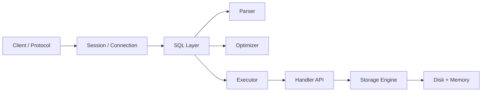

# Phase 0 — System Boundaries

> Before optimizing anything, understand what the system is and where the boundaries are.

## Core question
- What is `mysqld` actually responsible for?
- Where does SQL processing stop and storage engine responsibility start?
- What path does a query take from client to disk?

## Focus
- server architecture
- client protocol
- thread model
- query execution flow
- handler API
- InnoDB vs MyISAM at system level

## Knowledge model

## Primary reading
- Canonical sequence: `../roadmap-v2.md`
- First-principles framing: `../first-principles-learning.md`

## Expected outputs
- draw the end-to-end query path from memory
- explain server layer vs engine layer clearly
- explain why handler API exists

## Lab prompts
- connect to MySQL lab and inspect process / config basics
- trace a single query conceptually from parser to engine

## Reading ladder
- `read-1min.md`
- `read-5min.md`
- `read-10min.md`
- `read-full.md`

## Production bridge
Typical questions this phase helps answer:
- where would a problem likely live: protocol, SQL layer, engine, or storage?
- what kind of issue belongs to app connection pool vs MySQL internals?
