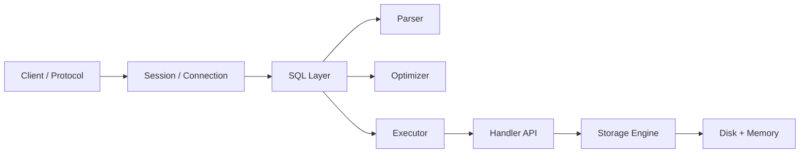

# Phase 0 — System Boundaries (1 minute)

## Core idea
Before studying internals, understand what the system is and where the boundaries are.



## The essential chain

```text
client sends SQL
  -> MySQL server receives connection
  -> SQL layer parses and plans
  -> executor calls storage engine
  -> engine reads/writes pages
  -> result goes back to client
```

## Minimal vocabulary
- **mysqld** = MySQL server process
- **SQL layer** = parser + optimizer + executor
- **storage engine** = where data is actually stored/accessed
- **handler API** = bridge between SQL layer and engine
- **thread-per-connection** = default concurrency model at connection level

## Production meaning
This phase helps answer:
- is this problem in connection handling, SQL planning, or storage?
- what belongs to app connection pool vs MySQL internals?
- why server/engine separation matters?

## Done when
You can explain:
1. the end-to-end path of one query
2. server layer vs engine layer
3. why handler API exists
4. why this mental map is needed before deeper internals
