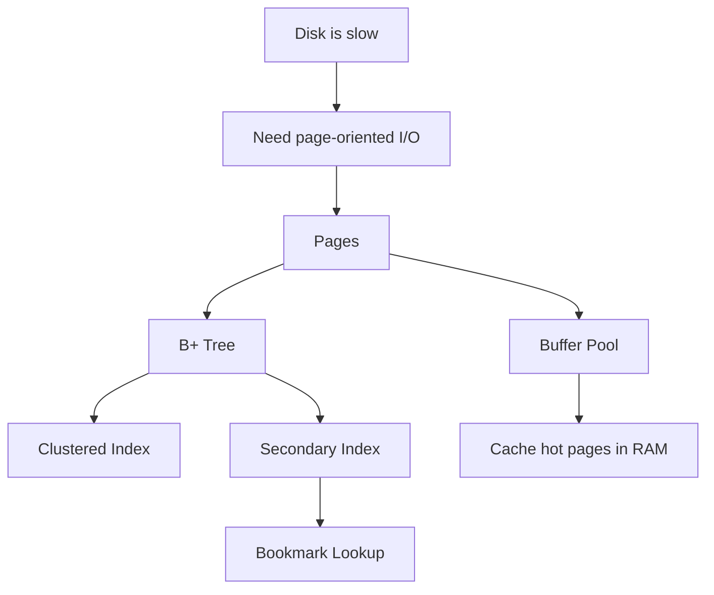

# Phase 1 — Storage (5 minutes)



## The first-principles question

> Disk is slow, RAM is fast. How does InnoDB store and retrieve data efficiently enough for OLTP?

## Start from physics
A database cannot pretend disk is cheap.
If every row lookup required raw disk access, performance would collapse.

So the engine must:
- batch I/O into larger units
- keep hot data in memory
- organize data for logarithmic lookup instead of scans

---

## 1. Pages
InnoDB works with **pages** (commonly 16KB), not single rows, as its core storage/I/O unit.

Why?
Because storage devices are far more efficient when accessed in blocks than in tiny row-sized fragments.

So the engine says:
- load a page
- work with many rows inside it
- write back pages later

---

## 2. Buffer pool
Once pages are the unit of I/O, the next move is obvious:

> keep frequently needed pages in RAM

That is the **buffer pool**.

It is the engine’s page cache for:
- data pages
- index pages

Important intuition:
- **free list** = unused pages
- **LRU list** = cached pages
- **flush list** = dirty pages that must eventually be written back

So the engine avoids many disk reads by serving page hits from RAM.

---

## 3. Why B+ tree
Now we need an efficient structure for finding the right page.

A scan is too expensive.
A hash structure is poor for ordered range scans.

A **B+ tree** fits because:
- it is ordered
- it supports point lookups and range scans
- each node can align well with a page
- tree height stays small, so lookup costs few page reads

---

## 4. Clustered index
In InnoDB, the primary key index is special.

It is the **clustered index**.
That means:
- leaf pages hold the full row
- rows are physically organized by primary key order

So primary key choice affects physical storage behavior, not just logical identity.

---

## 5. Secondary index
A secondary index does not hold full rows at the leaf level.
Instead, it usually holds:
- secondary key
- primary key value

That means when a query uses a secondary index and still needs columns not covered by it, the engine often does:

```text
secondary index lookup
  -> get primary key
  -> clustered index lookup
  -> fetch full row
```

This is the **bookmark lookup**.

---

## 6. Page split / merge intuition
When inserts happen, B+ tree pages may:
- split if full
- merge if too empty

This matters because random insert patterns can cause more structural churn than append-friendly patterns.

That is one reason PK design matters.

---

## Production meaning
This phase explains:
- why index design matters so much
- why covering indexes help
- why buffer pool sizing matters
- why bad PK choices can hurt write patterns
- why some queries cause much more I/O than expected

---

## Mental model to keep

```text
page-based storage
  -> buffer pool caches pages
  -> B+ tree finds pages efficiently
  -> clustered index stores full rows by PK order
  -> secondary index points back to clustered index
```

## If you remember 4 things
1. InnoDB works in pages, not row-at-a-time disk access.
2. Buffer pool is the core performance layer for reads.
3. B+ tree exists to minimize page I/O for lookup and range scan.
4. Secondary index often implies an extra clustered lookup unless the index covers the query.
