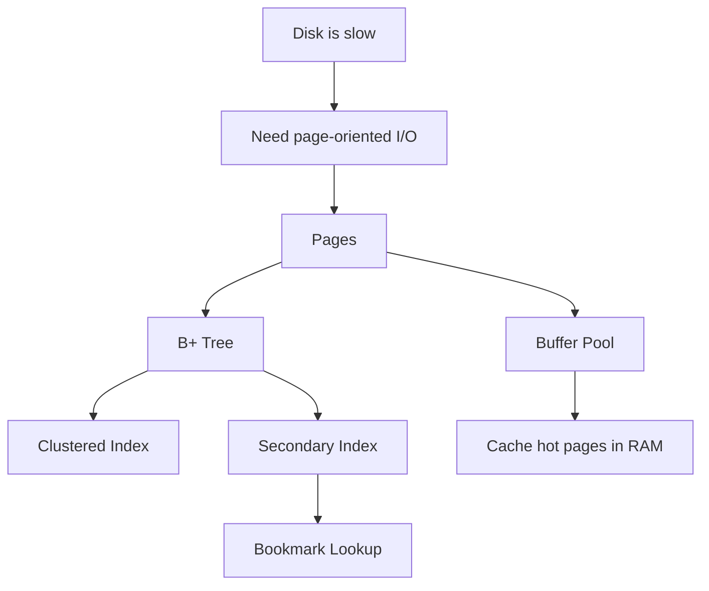

# Phase 1 — Storage (Full)



## 1. Why storage is the first real engine problem

A relational database promises durable data and fast access.
Those two goals immediately create tension because:
- durable storage lives on disk
- fast access wants RAM-like latency

The storage engine exists largely to bridge that gap.

If the SQL layer is about understanding and planning queries, the storage layer is about making those queries physically feasible.

This is why storage comes early in the roadmap.
Before concurrency, before optimizer nuance, before replication, you need to understand how data is physically organized and accessed.

---

## 2. Page-oriented thinking

Rows are logical records, but the storage engine cannot efficiently talk to hardware in terms of arbitrary row-sized fragments.

It needs a physical unit.
That unit is the **page**.

Why pages?
Because storage devices and filesystems naturally operate better in blocks than in tiny record fragments.
So the database chooses a page size and says:
- this is the unit I will cache
- this is the unit I will read from disk
- this is the unit I will dirty and flush back later

This single decision shapes almost everything that follows.

Once pages exist, the engine must answer:
- how are pages cached?
- how are pages located efficiently?
- how are page changes persisted?

This phase focuses mainly on the first two.

---

## 3. Buffer pool: the page cache inside InnoDB

If disk access were required for every page touch, MySQL performance would be unacceptable for OLTP.
So InnoDB keeps a large in-memory cache of pages: the **buffer pool**.

The buffer pool caches both:
- data pages
- index pages

This means many reads are served directly from memory.

### Internal intuition
Three conceptual lists matter a lot:

#### Free list
Pages available for new use.

#### LRU list
Cached pages tracked by recency and access temperature.
This is where replacement pressure happens.

#### Flush list
Dirty pages that have been modified and must eventually be written back to durable storage.

These lists reflect three different questions:
- what memory is available?
- what cached data is hottest or coldest?
- what modified data still needs persistence?

That separation is important.

### Young/old intuition
A useful refinement in InnoDB is the distinction between hotter and colder areas of the LRU behavior.
This helps protect the cache from one-time scans pushing out genuinely hot pages.

The first-principles reason is simple:

> recency alone is not enough; one-time scan traffic should not be allowed to masquerade as reusable heat

---

## 4. Why B+ tree is the storage engine’s natural structure

The storage engine still needs a way to find the right page quickly.

A full scan is O(n) and often too expensive.
A hash structure is poor for ordered range operations.

A B+ tree works well because it combines:
- logarithmic lookup
- ordered traversal
- range-scan friendliness
- high fan-out
- natural mapping from node to page

That last point matters a lot.
If a tree node fits well inside a page, then a traversal step roughly corresponds to one page read when not cached.
With high fan-out, the tree stays shallow.

So B+ tree is not just a theoretical data structure choice.
It is a physical-I/O-aware design choice.

---

## 5. Clustered index: the table’s main physical organization

InnoDB’s clustered index is not merely “one index among many”.
It is the table’s primary storage order.

The leaf pages of the clustered index contain the full row.
That means:
- the primary key defines leaf-level row ordering
- PK lookups are direct along the clustered tree
- PK range access benefits from this physical order

This is why primary key design matters deeply.
Choosing a primary key is simultaneously choosing:
- logical identity
- physical organization
- locality behavior for many accesses

This is a major distinction from engines where the main row storage is heap-like and indexes point into it differently.

---

## 6. Secondary index: alternate access paths

A single physical order is not enough.
Applications query by many dimensions.
So InnoDB also supports secondary indexes.

But a secondary index is not just a duplicate full copy of row storage.
In InnoDB, its leaf entries logically point back via the primary key value.

That means a typical secondary access path looks like this:

```text
secondary index search
  -> find matching entry
  -> obtain primary key value
  -> clustered index search
  -> fetch full row
```

This is the famous **bookmark lookup**.

The importance of this cannot be overstated.
It explains why:
- a secondary index may still be expensive for many-row retrieval
- covering indexes matter a lot
- low-selectivity indexes can still create large amounts of work

---

## 7. Covering index and why it helps so much

If the query only needs columns already present in the index, InnoDB may avoid the clustered lookup.
That is the power of a **covering index**.

This changes the physical work from:

```text
secondary tree traversal + clustered tree traversal
```

to:

```text
secondary tree traversal only
```

That is often a major performance win because it reduces:
- page touches
- random lookups
- CPU and latch activity around extra access

So a covering index is not magic.
It is simply eliminating one entire stage of physical work.

---

## 8. Page split and page merge

Trees must evolve under writes.

When a page becomes full and a new key needs to be inserted into it, the page may split.
When adjacent pages become sparse enough, they may merge.

This matters because write patterns influence structural maintenance cost.

Examples:
- append-like inserts tend to be friendlier in many cases
- random key inserts may cause more scattered modifications and split pressure

This is why index design affects not only reads but also write behavior.

---

## 9. Storage is where many performance myths break

A lot of shallow optimization advice sounds like:
- “just add an index”
- “PK is just identity”
- “if EXPLAIN says index then it’s fast”

Storage internals show why these are incomplete.

You need to ask:
- is the index selective enough?
- is it covering?
- what pages will it touch?
- how many bookmark lookups will occur?
- is the PK design helping or hurting locality?
- is the buffer pool likely to keep the needed pages hot?

That is a more physical, more realistic view.

---

## 10. Buffer pool + B+ tree together

Buffer pool and B+ tree are often taught as separate topics.
But they are really two halves of one system.

### B+ tree answers
- how do I find the page I need efficiently?

### Buffer pool answers
- once I need that page, can I avoid going to disk?

So the real performance of a query depends on both:
- access structure quality
- cache residency / hit behavior

This is one reason production performance is workload-dependent.
Two identical schemas can behave very differently under different page-temperature patterns.

---

## 11. Implications for application and schema design

This phase should change how a backend engineer thinks about schema and queries.

### Primary key choice
Not just logical identity.
Also affects clustering and physical order.

### Secondary index choice
Not just “can optimizer use it?”
Also “what extra clustered lookups will it create?”

### Composite index design
Not just syntax.
Also page-touch pattern and lookup efficiency.

### Covering strategy
Useful when a hot query repeatedly needs the same narrow column set.

### Buffer pool sizing
Not just a config knob.
It determines how much of the working set can avoid disk.

This is why database tuning is not separable from backend architecture.

---

## 12. Suggested labs for this phase

### Lab 1 — PK vs secondary lookup
- create a table with PK and one secondary index
- compare EXPLAIN and behavior for PK lookup vs secondary lookup
- explain the extra clustered step in the second case

### Lab 2 — covering vs non-covering
- run a query satisfied entirely by the index
- run a query needing extra columns from the base row
- compare plans and cost intuition

### Lab 3 — selectivity intuition
- use a low-cardinality column and a higher-cardinality column
- compare usefulness of indexes over each

### Lab 4 — page structure/size intuition
- inspect index/table size stats
- reason about why tree height remains low with large fan-out

### Lab 5 — insert pattern thought experiment
- compare append-like PK vs more scattered key behavior conceptually
- reason about page split likelihood

---

## 13. Production symptom map for this phase

### Symptom: query is indexed but still slow
Possible causes:
- low selectivity
- too many bookmark lookups
- poor composite order
- no covering benefit

### Symptom: random I/O is high
Possible causes:
- secondary-index-heavy workload returning many rows
- poor cache locality
- undersized buffer pool

### Symptom: writes are more expensive than expected
Possible causes:
- too many indexes to maintain
- page split pressure
- scattered insertion pattern

### Symptom: endpoint performance varies wildly
Possible causes:
- hot vs cold page behavior
- buffer pool churn
- access path touching large working sets

---

## 14. The compact mental model

Use this chain:

```text
disk is slow
  -> read/write in pages
  -> keep hot pages in RAM (buffer pool)
  -> organize access through B+ tree
  -> clustered index stores full rows in PK order
  -> secondary index leads back to clustered index
  -> query cost depends on page touches and cache residency
```

---

## 15. Explain-back checklist

You should be able to explain clearly:
1. why pages are the engine’s physical unit
2. why buffer pool exists and what its main lists represent
3. why B+ tree fits page-oriented storage
4. why clustered index is the table’s physical backbone
5. why secondary index often requires bookmark lookup
6. why covering indexes reduce work
7. why key/index design changes both reads and writes

If you can do that, your storage mental model is forming correctly.
