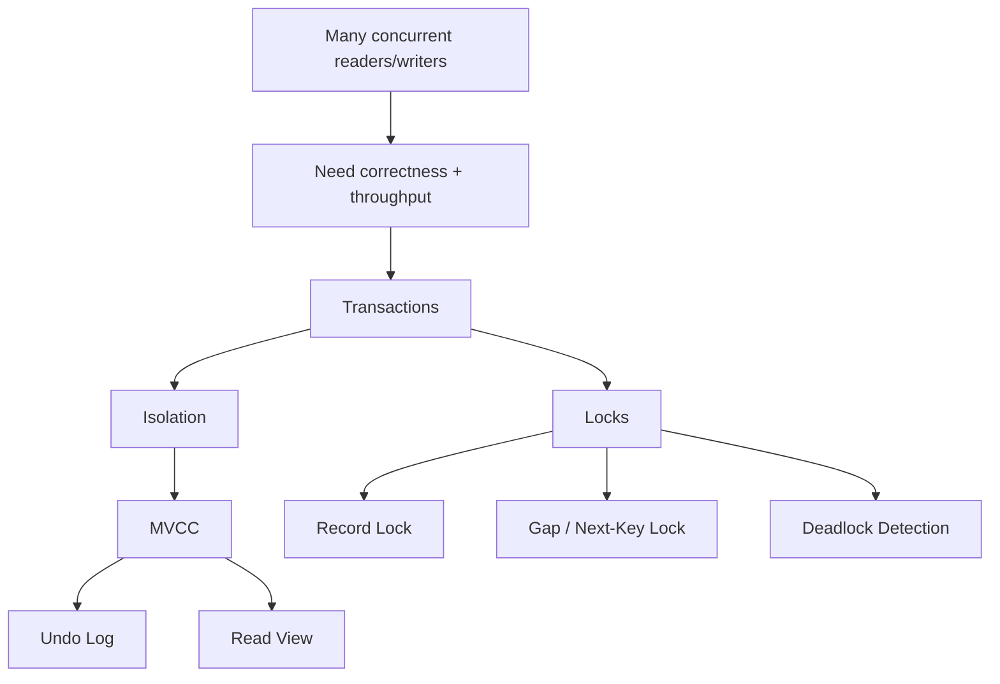

# Phase 2 — Concurrency (10 minutes)



## The root problem

A database is shared mutable state.

That means multiple concurrent clients may:
- read the same row
- update the same row
- update different rows in the same index range
- insert into a range another transaction is reasoning about

So concurrency is not an edge case. It is the normal case.

The engine must satisfy two competing goals:

```text
Goal A: keep results correct and explainable
Goal B: keep throughput acceptable under concurrency
```

A design that maximizes A only becomes a giant lock.
A design that maximizes B only becomes chaos.

InnoDB’s answer is a layered model:

```text
transactions
-> isolation levels
-> MVCC snapshot reads
-> locking for write/range conflicts
-> deadlock detection
```

---

## 1. Transactions are the unit of concurrency
A transaction defines:
- when work starts
- what belongs together
- when visibility becomes durable/committed
- what gets rolled back on failure

This matters because concurrency is not defined per statement alone.
It is defined over the lifetime of transactions.

If a transaction is long-lived, it holds onto:
- visibility boundaries
- locks
- undo history relevance

That is why long transactions are expensive even if they do little CPU work.

---

## 2. Isolation is about what changes a transaction may observe
A useful first-principles framing is:

> isolation level = the contract about which concurrent changes are allowed to be visible while I am still running

Practical anomalies to know:
- **dirty read**: reading uncommitted data
- **non-repeatable read**: rereading the same row gives a different committed value
- **phantom**: rereading a predicate/range gives new matching rows

In InnoDB, the practical comparison is usually:
- **READ COMMITTED**
- **REPEATABLE READ**

### READ COMMITTED
Each statement sees the latest committed state at its own start time.
Good for reducing some contention, but repeated reads may differ.

### REPEATABLE READ
A transaction’s consistent reads use a stable snapshot, so repeated reads stay stable.
This is why InnoDB needs stronger range-lock semantics in some cases.

---

## 3. Why MVCC exists
Suppose one transaction is updating a row while another transaction wants to read it.

Naive option:
- make the reader wait

But if this happens constantly, read throughput collapses.

Better option:
- let the reader see a previously committed version that is valid for its snapshot

That is **MVCC**.

MVCC means the engine conceptually supports multiple row versions over time.
The current row may be different from the version visible to a snapshot reader.

This is why concurrency in InnoDB is not just “locks”.
It is “locks + versions + visibility rules”.

---

## 4. Undo log: old versions and rollback
Undo log exists because the engine needs a way to:
- reverse changes on rollback
- reconstruct older row versions for snapshot reads

So when a row is updated, InnoDB does not just overwrite history conceptually.
It preserves enough old state to:
- back out the write if needed
- allow another transaction to read the correct older version

This is a key mental shift:

```text
undo log != only rollback machinery
undo log = rollback support + version history support
```

---

## 5. Read view: the visibility rule
A snapshot read needs a rule to decide:
- is this row version visible to me?
- if not, should I walk backward to an older version?

That rule is the **read view**.

A read view is basically a transaction-visibility snapshot.
It tracks which transaction IDs are considered active or already committed from the point of view of the reading transaction.

So the read path becomes roughly:

```text
read row
  -> check row's creating/updating transaction state against read view
  -> if visible, return it
  -> if not visible, follow undo chain to older version
  -> repeat until a visible version is found
```

This is the engine’s answer to “how can reads stay consistent without blocking everything?”

---

## 6. MVCC does not eliminate locks
People often overlearn MVCC and underlearn locks.
That is dangerous.

MVCC helps with many **consistent reads**.
But writes still need coordination.
And some reads deliberately acquire locks too.

Important lock types:

### Record lock
Lock on an index record.
Used for conflicts over specific existing rows.

### Gap lock
Lock on the gap between index records.
Protects a range from new inserts.

### Next-key lock
Record lock + preceding gap lock together.
Used to prevent phantoms under repeatable-read semantics.

The deep reason gap locks exist is not “because MySQL felt like it”.
It is this:

> if a transaction reasons about a range, protecting only existing rows is not enough; inserts into the gaps can invalidate the result

---

## 7. Phantom problem
Example idea:
- transaction A: `SELECT ... WHERE salary > 100000 FOR UPDATE`
- transaction B inserts a new qualifying row in that range

If A only locked existing rows, B could still insert a new matching row.
Then A’s reasoning about the range would be invalid.

That is why range-protection locks exist.

---

## 8. Deadlocks are normal
When different transactions acquire locks in different orders, cyclic waits can happen.

Example:
- A locks row 1, then wants row 2
- B locks row 2, then wants row 1

Now both wait forever unless the engine intervenes.

So InnoDB detects deadlocks and picks a victim to roll back.

Production lesson:
- some write paths must be retryable
- consistent lock acquisition order in the application reduces deadlocks

---

## 9. Why long transactions hurt
Long transactions keep old snapshots alive.
That has consequences:
- more undo versions must be preserved
- purge cannot reclaim history aggressively
- lock lifetime can become large
- contention and memory/history pressure grow

So a transaction that is “idle but open” is not harmless.

This is one of the most important backend lessons.

---

## 10. Application-layer mapping
This phase matters a lot for Java/Spring/backend work.

Because app code controls:
- transaction scope
- isolation level choice
- order of reads/writes
- retry logic
- whether hot rows or wide range updates are created

Common failure pattern:

```text
controller/service opens transaction
  -> does remote call / slow business logic / waits too long
  -> keeps transaction open
  -> increases contention and history pressure
```

So understanding MySQL concurrency is directly useful for service design.

---

## Production symptom map for this phase

### Symptom: deadlock spikes
Possible causes:
- inconsistent write ordering
- hot rows
- competing batch/OLTP traffic

### Symptom: lock wait timeout
Possible causes:
- long transaction
- missing/poor index causing wide locking
- large range update

### Symptom: throughput collapses under load
Possible causes:
- contention, not CPU
- too many transactions touching same ranges

### Symptom: purge/history issues
Possible causes:
- long-running snapshot transactions
- large write bursts with delayed cleanup

---

## The compact mental model

```text
shared mutable data
  -> need transactions
  -> need visibility rules
  -> use MVCC for snapshot reads
  -> use undo log to keep old versions
  -> use read view to decide visibility
  -> still need locks for writes and ranges
  -> need deadlock detection to break cycles
```

## What you should be able to explain after this phase
1. Why snapshot reads are possible
2. Why undo log matters beyond rollback
3. Why gap locks exist
4. Why deadlocks are expected in healthy concurrent systems
5. Why long transactions are operationally dangerous
