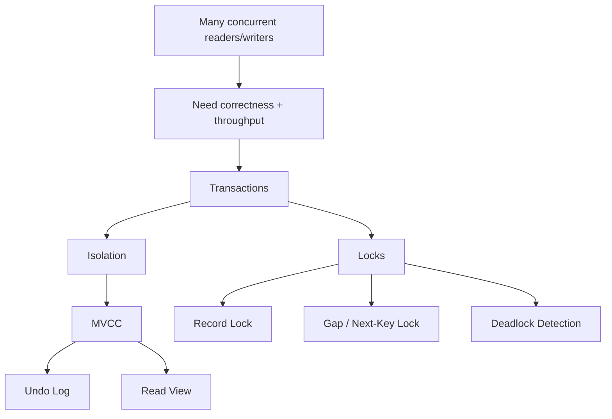

# Phase 2 — Concurrency (1 minute)

## Core idea
Concurrency exists because many users touch the same data at the same time.



The database must solve two problems at once:

```text
correctness
  +
throughput
```

If it only optimizes correctness:
- everything gets heavily locked
- throughput collapses

If it only optimizes throughput:
- data becomes inconsistent

## The essential chain

```text
many concurrent reads/writes
  -> need isolation
  -> readers should not always block writers
  -> need old versions of rows
  -> MVCC
  -> undo log + read view
  -> writers still conflict
  -> row/gap/next-key locks
  -> conflicts can cycle
  -> deadlock detection
```

## Minimal vocabulary
- **transaction** = a unit of work with commit/rollback
- **MVCC** = multiple row versions so snapshot reads can avoid blocking writes
- **undo log** = old row versions + rollback material
- **read view** = visibility rule for snapshot reads
- **record lock** = lock on an index record
- **gap lock** = lock on a range gap to prevent phantom inserts
- **next-key lock** = record lock + gap lock together
- **deadlock** = cyclic waiting; MySQL aborts one transaction

## Production meaning
Most backend pain here is not “B+ tree theory”.
It is:
- deadlocks
- lock wait timeout
- hot rows
- long transactions
- misunderstanding `REPEATABLE READ`

## Done when
You can explain:
1. why readers do not always block writers
2. why old versions must exist
3. why gap locks exist
4. why deadlocks are normal in concurrent systems
