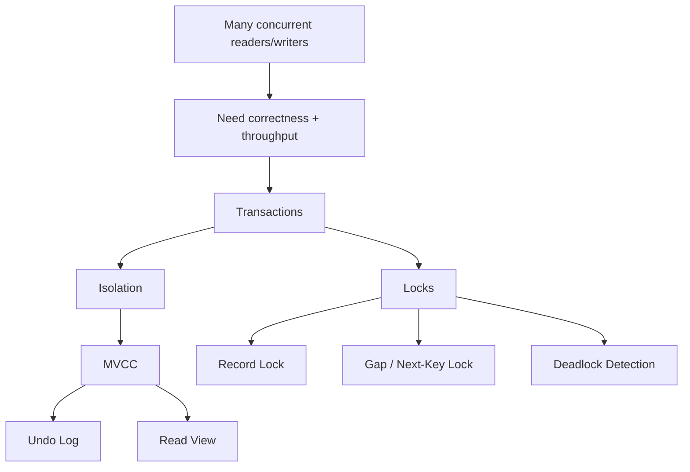

# Phase 2 — Concurrency (5 minutes)



## The first-principles question

> Many users read and write the same data at once. How can the database stay correct without destroying throughput?

## Start from the problem
Imagine two requests hitting the same row:
- request A reads it
- request B updates it
- request C inserts a new row into the same logical range

If the database simply locks everything aggressively:
- correctness improves
- but throughput becomes terrible

If the database barely locks:
- throughput improves
- but reads become inconsistent

So the engine needs a smarter design.

---

## The solution stack

```text
1. group operations into transactions
2. define isolation semantics
3. let many reads use snapshots instead of blocking writes
4. still lock write conflicts and dangerous ranges
5. detect cycles and break deadlocks
```

---

## 1. Transactions
A transaction says:
- these statements belong together
- either commit them or roll them back

This is the unit MySQL uses for concurrency semantics.

---

## 2. Isolation levels
Isolation answers:

> while my transaction is running, what changes from other transactions am I allowed to see?

The practical ones to care about most are:
- **READ COMMITTED**
- **REPEATABLE READ**

In InnoDB, default is usually **REPEATABLE READ**.

---

## 3. MVCC: why readers do not always block writers
The key move is:

> let reads see an older consistent version instead of forcing them to wait for every writer

This is **MVCC**.

To make this possible, InnoDB keeps:
- current row version
- older versions via **undo log**
- a **read view** to decide which version is visible to a transaction

So a read can often say:
- “I don’t need the newest in-flight version”
- “I’ll read the right committed snapshot version instead”

That is why many reads can proceed without blocking writes.

---

## 4. Undo log
Undo log is needed because:
- rollback must restore older values
- snapshot reads need old versions

So undo log is not just for rollback.
It is also part of read consistency.

---

## 5. Read view
A read view is basically a visibility rule.
It answers:
- which transactions were already committed?
- which were still active?
- should I see this row version or follow undo to an older one?

This is the heart of snapshot reads.

---

## 6. Why locks still exist
MVCC does **not** remove all locks.

Writers still conflict.
And some reads must lock too, especially locking reads.

Main lock types to understand:
- **record lock**: lock an index record
- **gap lock**: lock the gap between index records
- **next-key lock**: record + gap together

Why gap/next-key locks?
Because without them, a transaction could protect existing rows but still allow a new row to appear in the searched range — that is the phantom problem.

---

## 7. Deadlocks
If transaction A waits for B and B waits for A:
- nobody can progress
- this is a deadlock

Deadlocks are normal in concurrent systems.
InnoDB detects the cycle and rolls one transaction back.

Important mindset:
- deadlock is not proof the DB is broken
- it means the app must tolerate retries for some write paths

---

## 8. Production meaning
This phase explains many real production issues:
- why a simple update can block a whole workflow
- why long transactions are dangerous
- why batch jobs can starve OLTP traffic
- why retry logic must exist for some deadlocks
- why transaction scope matters in app code

---

## The mental model to keep

```text
correctness under concurrency
  -> transactions
  -> isolation rules
  -> MVCC for snapshot reads
  -> undo log + read view
  -> locks for write/range conflicts
  -> deadlock detection for cyclic waits
```

## If you remember 4 things
1. MVCC exists so reads do not always block writes.
2. Undo log is for both rollback and old-version visibility.
3. Gap/next-key locks exist to prevent phantoms.
4. Deadlocks are expected; design and retry accordingly.
