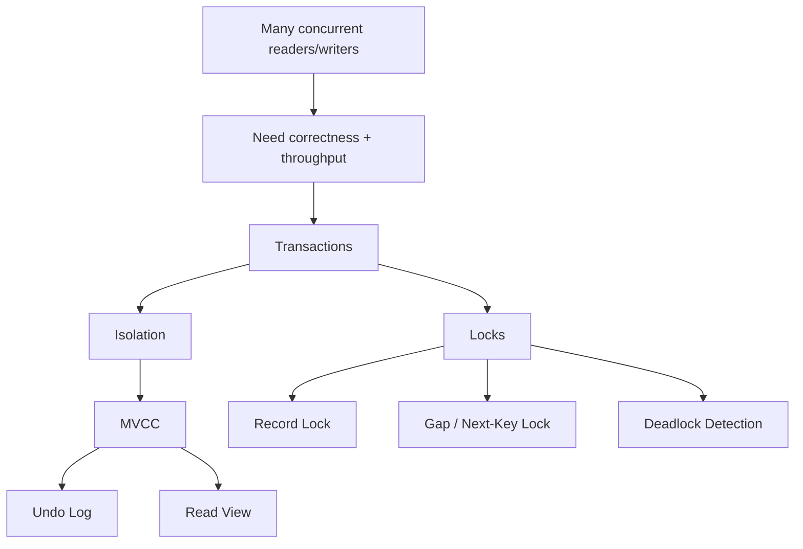

# Phase 2 — Concurrency (Full)



## 1. Why concurrency is a first-class problem

A database is not just a data store.
It is a shared coordination system.

The moment multiple clients use the same rows, indexes, and ranges concurrently, the database must answer questions like:
- what does each transaction get to see?
- when must one transaction wait for another?
- when can we avoid waiting by using snapshots?
- how do we stop circular waits from freezing progress?
- how do we preserve correctness without collapsing throughput?

This is why concurrency is one of the deepest parts of database engineering.

If storage explains where data lives, concurrency explains how many actors can safely use that data at once.

---

## 2. First-principles framing

The root reality is:

```text
multiple actors
  +
shared mutable state
  =
coordination problem
```

There are only a few broad ways to solve this:
- serialize everything
- lock aggressively
- keep multiple versions and define visibility rules
- combine multiple techniques

InnoDB chooses the combined approach:
- transactions define units of change
- MVCC provides snapshot reads
- locks protect writes and dangerous ranges
- deadlock detection handles cyclic conflicts

This is the heart of InnoDB concurrency.

---

## 3. Transactions: the unit of consistency and contention

A transaction is the unit in which:
- work is grouped
- visibility is controlled
- rollback is defined
- locks often live
- concurrency semantics are applied

The important lesson is that concurrency does not live only at the statement level.
It lives over transaction lifetimes.

That means transaction boundaries in app code are architecture decisions.

### Why this matters
Two systems may run the same SQL statements but behave very differently if one keeps transactions open 30 ms and the other keeps them open 30 seconds.

Longer transaction lifetime means:
- locks may be held longer
- read views may remain alive longer
- undo history may need to stay available longer
- purge may lag

So transaction design is not a minor ORM detail. It is core system behavior.

---

## 4. Isolation: what changes may a transaction observe?

Isolation level defines the visibility contract between concurrent transactions.

A useful framing is:

> isolation level says how much of the outside world is allowed to change underneath you while your transaction is still in progress

Important anomaly concepts:

### Dirty read
A transaction sees uncommitted data from another transaction.
This is usually unacceptable for OLTP systems.

### Non-repeatable read
The same row read twice in one transaction yields different committed values.

### Phantom
The same predicate/range read twice yields a different set of matching rows because inserts/deletes changed the result set.

In practice for InnoDB-backed backend systems, the most important comparison is:
- READ COMMITTED
- REPEATABLE READ

### READ COMMITTED
Each statement gets a fresh committed snapshot.
A transaction can reread a row and see a different committed value later.

### REPEATABLE READ
Consistent reads in the same transaction reuse a stable snapshot, so rereading gives the same view.
To uphold this semantics in locking scenarios, InnoDB may need stronger range protection.

---

## 5. MVCC: why readers often do not block writers

A naive locking design says:
- if a row is being updated, readers wait
- if a row is being read, writers may wait

This can preserve correctness, but at terrible throughput under real workloads.

InnoDB’s smarter move is:

> for many reads, do not require the latest in-flight version; instead, provide the correct committed version for that reader’s snapshot

This is Multi-Version Concurrency Control.

The key idea is that row state is not conceptually a single value.
There may be:
- a newest version being changed by another transaction
- an older committed version visible to a snapshot reader

That is why a read can proceed without blocking a concurrent write in many cases.

This is also why learning concurrency as “locks only” is incomplete.
InnoDB concurrency is really:

```text
versions + visibility rules + locks
```

---

## 6. Undo log: rollback and version history

Undo log exists because the engine must remember enough old information to:
1. reverse a transaction on rollback
2. reconstruct older row versions for snapshot reads

This second use is easy to underestimate.

If transaction B updates a row, and transaction A still needs the older visible version, that older version has to come from somewhere.
Undo log provides the historical chain.

So when a row changes, the engine effectively preserves its prior logical state in undo records.
Then reads can walk backward through version history if the newest version is not visible under the reader’s read view.

### Important mental model

```text
undo log is not just rollback support
undo log is also part of read consistency infrastructure
```

---

## 7. Read view: the visibility algorithm

A snapshot read needs a rule to decide whether the current version of a row is visible.
That rule is the read view.

A read view is essentially a snapshot of transaction visibility state.
It distinguishes between transactions that are:
- already committed
- still active
- newer than the reader’s snapshot boundary

The conceptual read path becomes:

```text
read current row version
  -> compare row version metadata with read view
  -> if visible, return it
  -> if not visible, follow undo chain
  -> continue until a visible version is found
```

This is how InnoDB gives many readers a stable snapshot without blocking concurrent writes.

The exact internal rules involve transaction IDs and visibility boundaries, but the essential lesson is simple:

> read view tells a transaction which versions count as part of its world

---

## 8. Consistent reads vs locking reads

Not every read behaves the same way.

### Consistent read
A normal snapshot read uses MVCC visibility rules and often avoids blocking writers.
This is what many ordinary SELECTs rely on.

### Locking read
Statements like `SELECT ... FOR UPDATE` or `SELECT ... LOCK IN SHARE MODE` intentionally acquire locks.
These are not “just reads”; they are coordination operations.

This distinction matters because many developers assume all reads are harmless.
But once a read becomes part of a write workflow or invariant check, it may turn into a lock-acquiring operation.

---

## 9. Why locks still matter even with MVCC

MVCC solves only part of the concurrency problem.

It helps many readers avoid blocking writers.
But it does not solve:
- two writers modifying the same row
- range protection for predicates
- ordered update conflicts
- explicit locking reads

That is why locking remains essential.

### Record lock
A lock on an index record.
Used to protect an existing row.

### Gap lock
A lock on the gap between index records.
Used to prevent inserts into that range.

### Next-key lock
A combination of record lock and gap lock.
This is crucial for preventing phantoms under repeatable-read semantics.

---

## 10. Phantom problem and why gap/next-key locks exist

Suppose a transaction reasons over a range:

```sql
SELECT * FROM accounts WHERE balance > 1000 FOR UPDATE;
```

If only existing matching rows are locked, another transaction could still insert a new row with `balance = 5000` into the range.
Now the original transaction’s reasoning about the set of matching rows is no longer stable.

This is the phantom problem.

The first-principles reason for gap locks is:

> protecting only existing records is not enough when the invariant depends on a range; the gaps themselves must sometimes be protected

This is subtle but extremely important.

It also explains why index design affects locking behavior.
A poor index can broaden the scanned and locked ranges, increasing contention.

---

## 11. Deadlocks: expected outcome of cyclic wait

Whenever transactions acquire resources in different orders, cyclic waiting can happen.

Example:
- transaction A locks row 1, then wants row 2
- transaction B locks row 2, then wants row 1

Now progress is impossible without intervention.
This is a deadlock.

Deadlocks are not an anomaly of a broken database. They are a normal consequence of concurrent coordination under conflicting access patterns.

InnoDB detects deadlocks and chooses a victim transaction to roll back.

### Operational lesson
Applications must often:
- retry some write paths
- keep transaction scope narrow
- maintain consistent resource acquisition order where possible

This is why database literacy matters at the application layer.

---

## 12. Long transactions are expensive even when “idle”

Long transactions are dangerous because they extend the lifetime of concurrency artifacts.

They can:
- keep old snapshots alive
- prevent undo history from being purged quickly
- hold locks for longer
- widen the window for conflicts
- increase crash recovery complexity indirectly through extra work accumulation

A backend service that opens a transaction and then:
- does network calls
- waits on another service
- performs slow business logic
- streams a large response

is effectively turning concurrency semantics into an application latency amplifier.

This is one of the most practical lessons in all of MySQL internals.

---

## 13. Connection to Java / backend application design

For a Java/backend engineer, this phase maps directly to design choices such as:
- `@Transactional` scope
- isolation level selection
- retry behavior on deadlocks
- connection pool sizing
- ordering of repository updates
- batch write strategies

A typical failure pattern looks like this:

```text
service method starts transaction
  -> loads data
  -> calls remote API
  -> does validation/business logic
  -> writes rows late
  -> transaction stayed open far too long
  -> contention and history pressure rise
```

Another common problem:

```text
two code paths update the same entities in different order
  -> lock order differs
  -> deadlocks become frequent
```

So concurrency understanding is not only for DBAs.
It is core backend engineering knowledge.

---

## 14. Practical diagnosis map for this phase

### Symptom: deadlock spikes
Look for:
- conflicting write order
- batch jobs colliding with OLTP traffic
- hot rows or small hot ranges

Inspect:
- `SHOW ENGINE INNODB STATUS`
- lock-wait views
- query patterns touching same entities in different order

### Symptom: lock wait timeout
Look for:
- long-running transactions
- missing/inefficient indexes causing broad scanned-and-locked ranges
- large update/delete batches

### Symptom: throughput collapse under write-heavy load
Look for:
- contention rather than CPU
- too many concurrent writes to same keys/ranges
- over-wide transaction scope

### Symptom: purge/history-related pressure
Look for:
- transactions staying open too long
- long-lived snapshot readers
- write-heavy system plus delayed cleanup

---

## 15. Suggested lab path

A practical concurrency lab should include at least these experiments:

### Lab 1 — basic lock wait
- session A updates a row but does not commit
- session B updates the same row
- observe waiting behavior

### Lab 2 — snapshot read intuition
- session A starts transaction and reads a row
- session B updates and commits
- session A rereads under different isolation levels
- compare visibility behavior

### Lab 3 — phantom/range protection intuition
- transaction A performs locking read on a range
- transaction B tries to insert into that range
- observe whether it waits

### Lab 4 — deadlock
- session A locks row 1 then requests row 2
- session B locks row 2 then requests row 1
- watch InnoDB choose a victim

### Lab 5 — long transaction impact
- hold transaction open intentionally
- generate writes elsewhere
- inspect system behavior and history/lock impact conceptually through instrumentation

---

## 16. The compact mental model

If you need one durable model to remember, use this:

```text
shared mutable state
  -> need transactions
  -> need a visibility contract (isolation)
  -> use MVCC so many reads can use snapshots
  -> use undo log to preserve older versions
  -> use read view to decide visibility
  -> use locks for write and range conflicts
  -> use deadlock detection to break cyclic waits
  -> keep transactions short to avoid operational pain
```

---

## 17. Explain-back checklist

You should be able to explain all of these in your own words:

1. Why MVCC exists
2. Why undo log matters beyond rollback
3. What a read view does
4. Why consistent reads and locking reads are different
5. Why gap locks exist
6. Why deadlocks are expected, not shocking
7. Why long transactions damage system health
8. How app transaction design directly affects MySQL concurrency behavior

If you can explain those cleanly, the phase is working.
