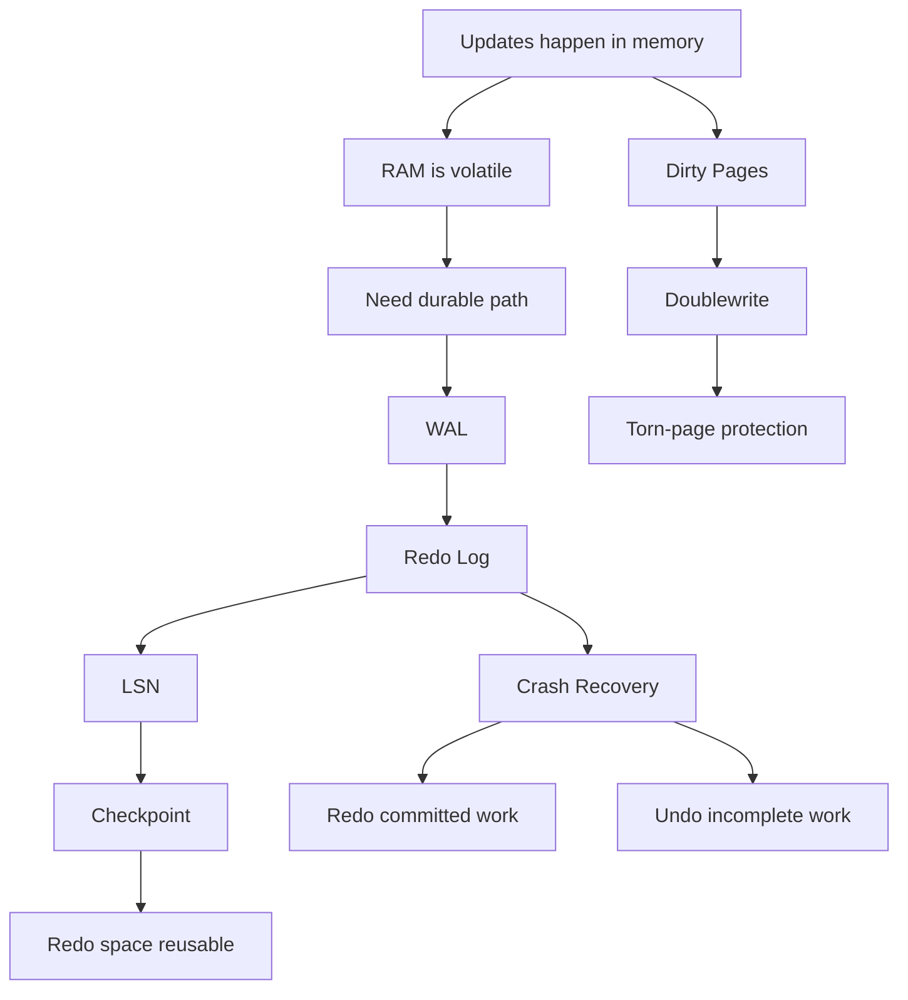

# Phase 3 — Durability (1 minute)

## Core idea
Durability exists because RAM is volatile.



If a transaction commits, the database must survive crash and still recover that committed change.

## The essential chain

```text
changes happen in memory
  -> memory can be lost on crash
  -> must log change before page flush
  -> WAL
  -> redo log
  -> redo space is finite
  -> checkpoint
  -> page writes are not always atomic
  -> doublewrite buffer
  -> crash happens
  -> redo recovery + undo for uncommitted work
```

## Minimal vocabulary
- **WAL** = write-ahead logging
- **redo log** = log used to recover committed changes after crash
- **LSN** = position in redo stream
- **checkpoint** = point up to which dirty pages are safely flushed
- **doublewrite** = torn-page protection
- **crash recovery** = redo committed work, undo incomplete work

## Production meaning
This phase explains:
- what COMMIT really means
- why data pages do not need to flush on every commit
- why crash recovery works
- why checkpoint pressure and redo pressure matter

## Done when
You can explain:
1. why redo is written before data page flush
2. why commit can be fast even if data page is still dirty in memory
3. why checkpoint exists
4. why doublewrite protects against torn pages
