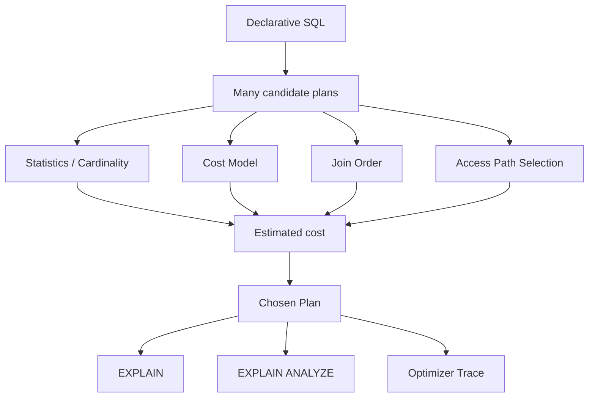

# Phase 4 — Optimizer

> One query can have many plans. How does MySQL choose one?

## Core question
- What candidate plans exist?
- How does cost model guide plan choice?
- Why do stale statistics create bad plans?
- When should optimizer behavior be inspected before tuning blindly?

## Focus
- statistics and cardinality
- cost model
- join order
- access path selection
- optimizer trace
- EXPLAIN and EXPLAIN ANALYZE

## Knowledge model

## Primary reading
- Canonical sequence: `../roadmap-v2.md`

## Expected outputs
- read plans with confidence
- predict when optimizer may choose badly
- explain how cost and cardinality interact

## Lab prompts
- compare plans under different data distributions
- inspect optimizer trace
- compare estimated vs actual rows

## Reading ladder
- `read-1min.md`
- `read-5min.md`
- `read-10min.md`
- `read-full.md`

## Production bridge
Typical symptoms mapped here:
- unstable query latency from plan changes
- regressions after schema/data-distribution changes
- wrong join order / full scans due to poor estimates
