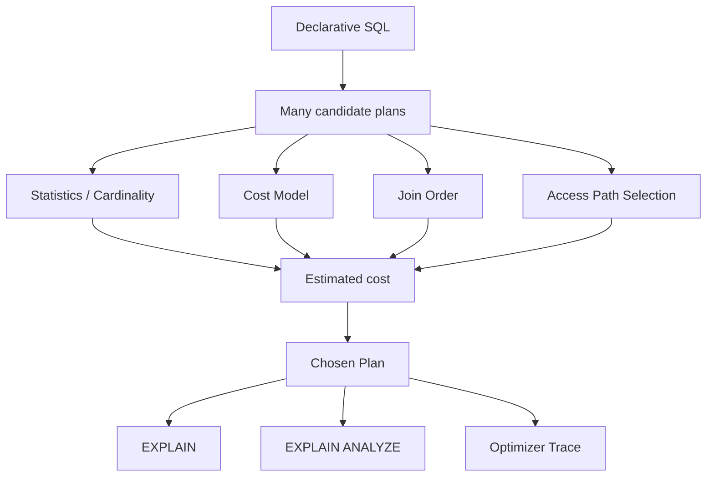

# Phase 4 — Optimizer (1 minute)

## Core idea
A SQL query can often be executed in many different ways.
The optimizer exists to choose the cheapest one.



## The essential chain

```text
same SQL
  -> many candidate plans
  -> choose access path
  -> choose join order
  -> estimate cost from statistics
  -> pick cheapest estimated plan
```

## Minimal vocabulary
- **optimizer** = plan chooser
- **cost model** = how the engine prices candidate plans
- **cardinality/statistics** = estimates about data distribution
- **join order** = table visitation order in multi-table plans
- **EXPLAIN** = estimated plan view
- **EXPLAIN ANALYZE** = actual execution view
- **optimizer trace** = why the optimizer considered/rejected plans

## Production meaning
Bad plans can come from:
- stale or misleading statistics
- wrong join order
- low-selectivity indexes
- candidate plans that look cheap but are not

## Done when
You can explain:
1. why the same SQL can have many plans
2. why statistics matter
3. why join order matters
4. why EXPLAIN and EXPLAIN ANALYZE are both needed
