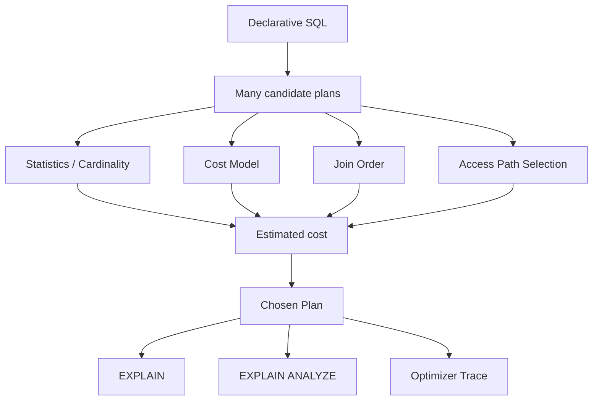

# Phase 4 — Optimizer (5 minutes)



## The first-principles question

> If the same SQL can run in multiple ways, how does MySQL decide which path is best?

## Start from the problem
For a simple query, there may be choices like:
- full scan vs index lookup
- one index vs another index
- join table A first vs table B first
- nested loop vs another join strategy

The optimizer exists to search this space and choose a plan.

---

## 1. Cost-based optimization
MySQL uses a **cost-based optimizer**.

That means it estimates the cost of candidate plans and selects the lowest-cost one.

The cost is based on things like:
- I/O work
- CPU work
- row counts
- temp/sort work

---

## 2. Statistics and cardinality
The optimizer cannot choose well blindly.
It needs estimates about data distribution.

Examples:
- how many rows match `department = 'Engineering'`?
- how selective is this index?
- how many rows will survive this filter?

If these estimates are bad, the optimizer may choose a bad plan.

---

## 3. Join order matters
For joins, reading the smaller/more selective side first can change total cost dramatically.

So optimizer work is not only:
- which index?

It is also:
- which table first?
- then which next?

This is why join order is one of the most important optimizer decisions.

---

## 4. EXPLAIN vs EXPLAIN ANALYZE
- **EXPLAIN** shows the estimated plan
- **EXPLAIN ANALYZE** runs the query and shows real behavior

If estimated rows and actual rows diverge a lot, that is a clue the optimizer’s model is off.

---

## 5. Optimizer trace
When you need to know *why* a plan was chosen, optimizer trace is extremely useful.

It helps answer:
- what plans were considered?
- which were pruned?
- what cost comparison happened?

---

## Production meaning
This phase explains:
- unstable latency after data distribution changes
- plan regressions after schema/index changes
- why “there is an index” does not guarantee a good plan

---

## Mental model to keep

```text
candidate plans
  -> estimated by statistics and cost model
  -> join order + access path chosen
  -> EXPLAIN shows estimate
  -> EXPLAIN ANALYZE reveals reality
```

## If you remember 4 things
1. The optimizer is a plan chooser, not magic.
2. Statistics quality heavily influences plan quality.
3. Join order is often as important as index choice.
4. Real tuning starts when you compare estimate vs actual.
