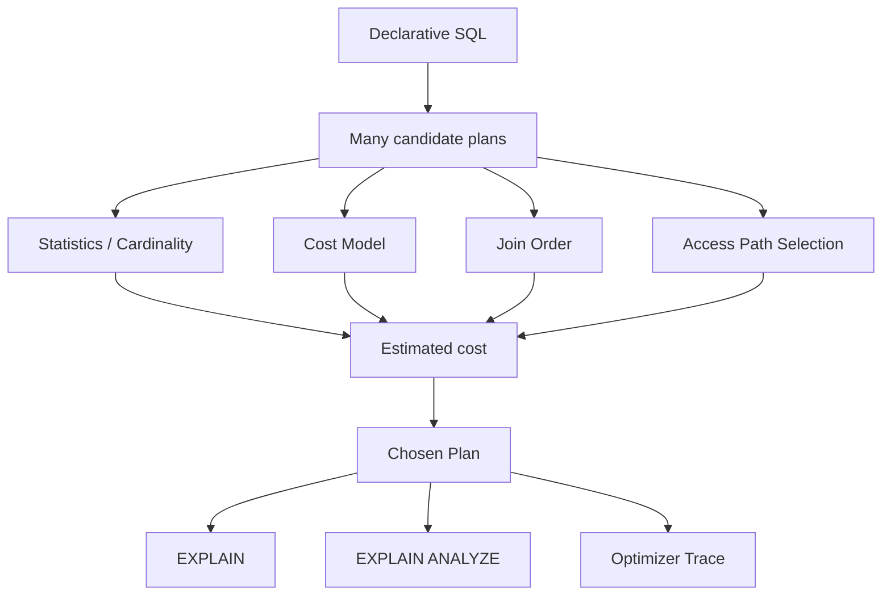

# Phase 4 — Optimizer (Full)



## 1. Why the optimizer exists at all

SQL is declarative.
You ask for a result set, not a physical procedure.

That means the database must decide how to obtain the result.
This creates an execution-plan search problem.

Even a simple query may have multiple valid strategies:
- full scan vs index access
- which index to use
- which table to read first in a join
- how to combine filters
- whether a covering path is available

Some plans are cheap.
Some are catastrophic.
The optimizer exists to choose among them.

---

## 2. The optimizer is a model-driven planner

The optimizer does not know the future.
It predicts.

That is why a useful mental model is:

> the optimizer is a planner operating on an imperfect model of the data and cost landscape

It uses:
- statistics/cardinality estimates
- cost heuristics/constants
- access-path rules
- join-search heuristics

This explains an important truth:

A bad plan does not necessarily mean the optimizer is stupid.
It may simply mean its model was inaccurate.

---

## 3. Candidate plan space

A query can generate many possible candidate plans.
Examples:
- scan table A first or table B first
- use index X or index Y
- use a covering path or not
- apply predicates earlier or later
- choose one join strategy over another

As query complexity grows, this space expands quickly.
So the optimizer cannot brute-force every possible path indefinitely.
It has to prune, approximate, and rank candidates.

This is why optimizer behavior is not purely deterministic from syntax alone.
It depends on the engine’s internal estimate process.

---

## 4. Cost model

The optimizer is cost-based.
That means it evaluates candidate plans according to an internal notion of cost.

Conceptually, cost may include:
- number of rows touched
- page access volume
- CPU comparisons/filter work
- join expansion work
- sort or temporary table effort

The exact internal formulas are not the main lesson.
The main lesson is:

> plan choice is cost ranking over estimated work

So if two plans are possible, the optimizer picks the one it believes is cheaper.

This is why understanding cost reasoning is more valuable than memorizing random EXPLAIN patterns.

---

## 5. Statistics and cardinality: the optimizer’s worldview

Statistics tell the optimizer roughly how the data is distributed.

Examples:
- how selective is `department = 'Engineering'`?
- how many distinct values exist in a column?
- how many rows may survive a predicate?
- how large will an intermediate join result become?

Without statistics, the optimizer is effectively blind.

This means many plan problems are really estimate problems.
If it thinks a predicate filters down to a tiny set but in reality it matches a huge fraction of rows, the chosen plan may be disastrously wrong.

That is why plan analysis must often ask:
- was the optimizer’s estimate reasonable?

not just:
- did it use the index I expected?

---

## 6. Join order: one of the most important decisions

In multi-table queries, join order is often more important than any single index detail.

Why?
Because the number of rows flowing into later stages depends heavily on what was read first.

A highly selective starting table can reduce downstream work dramatically.
A low-selectivity starting table can explode work early.

So join order is not cosmetic.
It is often the dominant factor in query cost.

This is one reason the optimizer’s search problem is hard.
It must evaluate a join order space that grows rapidly with more tables.

---

## 7. Access path selection

Once join order or table visitation order is being considered, the optimizer still needs to choose access paths.

Examples:
- full table scan
- range scan on an index
- ref lookup
- covering index access
- index merge or other fallback choices

This is where schema design and optimizer behavior meet.
An index is only useful if it creates a genuinely cheaper candidate plan.

That is why “there is an index” and “the optimizer should use this index” are not the same statement.

---

## 8. EXPLAIN vs EXPLAIN ANALYZE

### EXPLAIN
Shows the optimizer’s chosen plan and estimated behavior.
This is the planner’s forecast.

### EXPLAIN ANALYZE
Executes the query and reveals what actually happened.
This is the observed reality.

The gap between these is often where insight appears.

If the estimated row count and actual row count differ dramatically, the engine may have chosen a plan that only looked good under bad assumptions.

That is why EXPLAIN alone is not enough for serious understanding.
It shows the optimizer’s belief, not necessarily the truth.

---

## 9. Optimizer trace: the “why” tool

Sometimes even EXPLAIN is not enough, because it shows the final choice but not the alternative plans that were considered and rejected.

Optimizer trace helps answer:
- what candidate plans were explored?
- what estimates were used?
- why was a plan pruned?
- why did the optimizer prefer one path over another?

This is one of the most educational tools for building optimizer intuition.
It turns black-box plan choice into something more inspectable.

---

## 10. Why this phase is distinct from performance tuning

This phase is about plan selection logic.
It is about understanding the optimizer as a reasoning engine.

That is different from broader tuning work.

### Optimizer phase asks
- why did the engine choose this plan?
- what was its cost reasoning?
- what estimate likely drove the choice?

### Performance tuning phase asks
- what symptom is happening in production?
- is this CPU, I/O, locking, memory, or plan-related?
- what is the least risky intervention?

The distinction matters.
You can know a plan is bad without yet having a disciplined tuning workflow.
Roadmap v2 intentionally separates those skills.

---

## 11. Application and operational implications

For backend engineers, this phase explains why queries can regress even when code stays unchanged.

Reasons include:
- the data distribution changed
- the relative selectivity of predicates changed
- statistics drifted
- a new index altered the plan search space
- join cardinality changed significantly

This is why performance debugging sometimes starts with no code diff at all.
The workload and data shape changed, so the optimizer made a new choice.

This is also why plan literacy is part of production engineering, not just database theory.

---

## 12. Production symptom map for optimizer issues

### Symptom: same query is suddenly much slower
Possible causes:
- changed data distribution
- stale or misleading statistics
- new competing plan looked cheaper to optimizer

### Symptom: index exists but query still scans a lot
Possible causes:
- low selectivity
- cost model preferred scan
- filter placement made indexed path unattractive

### Symptom: join query latency exploded
Possible causes:
- wrong join order
- cardinality misestimate
- unexpectedly large intermediate result

### Symptom: unstable latency across environments
Possible causes:
- different data distribution
- different statistics freshness
- different optimizer version/features

---

## 13. Suggested labs for this phase

### Lab 1 — compare candidate access paths
- run a query with multiple possible indexes
- inspect chosen key in EXPLAIN
- reason about why that path won

### Lab 2 — estimated vs actual rows
- run EXPLAIN ANALYZE
- compare row estimates with reality
- explain what bad estimates would do to plan ranking

### Lab 3 — join order sensitivity
- run a join query with selective and non-selective predicates
- inspect plan order
- reason about what a worse join order would cost

### Lab 4 — optimizer trace
- enable trace
- run a moderately interesting query
- inspect considered alternatives and cost reasoning

### Lab 5 — data distribution shift
- imagine or simulate skewed data
- reason about how the same SQL might get a different plan later

---

## 14. Compact mental model

Keep this chain:

```text
SQL declares the result
  -> optimizer searches possible plans
  -> statistics and cost model shape the ranking
  -> join order and access path dominate total work
  -> EXPLAIN shows optimizer belief
  -> EXPLAIN ANALYZE shows execution reality
  -> optimizer trace explains the choice process
```

---

## 15. Explain-back checklist

You should be able to explain clearly:
1. why the same SQL may have many plans
2. why the optimizer depends on statistics
3. why join order is a first-class decision
4. why a bad plan can happen without code changes
5. why EXPLAIN and EXPLAIN ANALYZE serve different purposes
6. why optimizer trace is valuable for deeper investigation

If you can do that, this phase is working.
