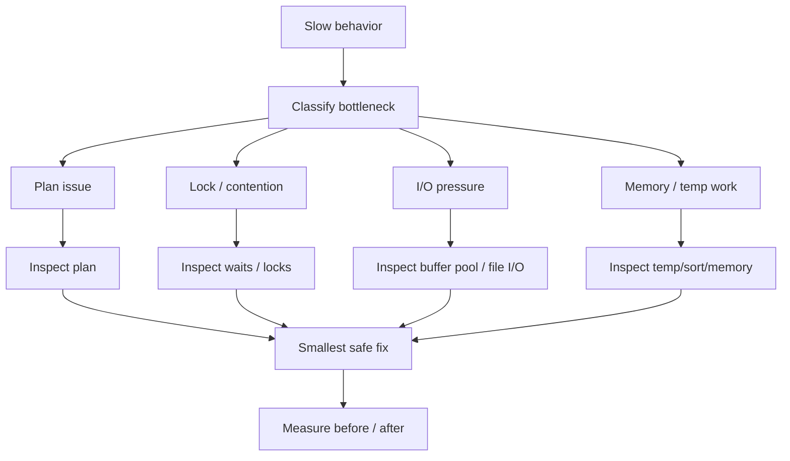

# Phase 5 — Performance Tuning

> When the system is slow, how do you diagnose before you optimize?

## Core question
- Is the slowdown from CPU, I/O, locking, memory, or a bad plan?
- Which fixes are safe, and which are cargo-cult tuning?

## Focus
- execution behavior in reality
- performance diagnosis workflow
- slow query analysis
- anti-patterns
- index trade-offs
- workload-aware tuning
- safe SQL rewrite and tuning habits

## Knowledge model

## Primary reading
- Cross-cutting reference: `../production-symptom-map.md`
- Canonical sequence: `../roadmap-v2.md`

## Expected outputs
- map symptom -> mechanism -> signal -> action
- distinguish optimizer problem from contention problem
- tune with evidence, not superstition

## Lab prompts
- compare before/after for bad queries
- inspect slow query log and sys/performance schema views
- test several anti-patterns and their rewrites

## Reading ladder
- `read-1min.md`
- `read-5min.md`
- `read-10min.md`
- `read-full.md`

## Production bridge
Typical symptoms mapped here:
- intermittent slow endpoints
- full table scans in hot paths
- excessive filesort/temp table use
- index bloat from over-tuning
