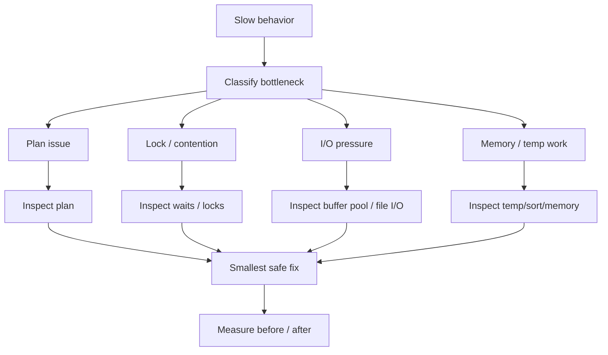

# Phase 5 — Performance Tuning (10 minutes)



## The root problem

Once a system is in production, the question changes.

Earlier phases asked:
- how is data stored?
- how does concurrency work?
- how does durability work?
- how does the optimizer choose plans?

Now the operational question becomes:

> the system is slow — what exactly is limiting it, and what is the safest useful fix?

That is the essence of performance tuning.

---

## 1. Slowness is not a diagnosis
A slow query or slow endpoint is only a symptom.

The real cause could be very different across cases:
- bad access plan
- huge row examination
- lock waits
- disk I/O pressure
- too many temporary structures
- memory pressure
- excessive work from query shape

That is why tuning must begin with classification, not with changes.

---

## 2. Bottleneck classification
A practical first move is to ask:

```text
Is this mainly a
- plan problem?
- contention problem?
- I/O problem?
- CPU/work problem?
- memory/temp problem?
```

This single question already prevents a lot of bad tuning.

Because if the root issue is lock waits, adding an index may not help much.
And if the issue is a terrible scan-heavy plan, tweaking connection settings is noise.

---

## 3. Evidence sources
This phase brings multiple tools together:
- EXPLAIN / EXPLAIN ANALYZE
- slow query log
- performance_schema
- sys schema
- InnoDB status views

The point is not to memorize commands.
The point is to combine evidence from:
- the query plan
- actual execution behavior
- wait/lock patterns
- workload-level signals

---

## 4. Query anti-patterns
A lot of tuning work is removing recurring forms of waste.

Examples:
- function-wrapped indexed columns
- correlated subqueries that scale badly
- OR-heavy filters that defeat efficient access
- wide range scans on hot paths
- non-covering access on very frequent reads

This is why performance tuning is partly a pattern-recognition skill.

---

## 5. Tuning is about justified interventions
A safe tuning decision should answer:
- what mechanism is hurting us?
- what change targets that mechanism?
- what is the risk of this change?
- how will we verify success?

Examples:
- add composite index because actual plan examines far too many rows
- rewrite query to become sargable
- reduce transaction scope because wait data points to contention
- avoid over-indexing if write cost is already the issue

---

## 6. Optimizer vs tuning distinction
This phase depends on optimizer knowledge, but is broader.

### Optimizer phase
- why was this plan chosen?

### Tuning phase
- what observable problem is happening in production?
- what evidence supports the root-cause hypothesis?
- what intervention is lowest-risk and highest-leverage?

That distinction is important.
Tuning is operational decision-making, not just plan reading.

---

## 7. Backend/production implications
For backend systems, performance issues often surface as:
- a slow endpoint
- queue buildup
- thread pool exhaustion
- connection pileups
- intermittent spikes instead of steady slowness

This means SQL tuning must often be connected to:
- transaction design
- request patterns
- concurrency behavior
- workload shape

That is why architect-level tuning must think beyond isolated query text.

---

## 8. Typical diagnosis map

### Symptom: endpoint slow only under load
Possible causes:
- contention
- lock waits
- hot rows
- query plan that degrades with larger row counts

### Symptom: query always slow
Possible causes:
- scan-heavy plan
- poor index support
- expensive sort/temp path

### Symptom: performance unstable over time
Possible causes:
- plan drift
- data skew
- cache-temperature differences
- workload concurrency variation

### Symptom: write path slow after adding indexes
Possible causes:
- over-indexing
- write amplification
- extra maintenance cost, not read-path problem

---

## The compact mental model

```text
slow symptom
  -> classify bottleneck
  -> inspect plan + waits + workload evidence
  -> identify probable mechanism
  -> choose smallest safe change
  -> validate before/after
```

## What you should be able to explain after this phase
1. why tuning begins with bottleneck classification
2. how to separate query-plan issues from contention issues
3. why anti-pattern recognition matters
4. why the safest fix is often the smallest evidence-backed fix
5. why production tuning must consider workload shape, not just SQL text
