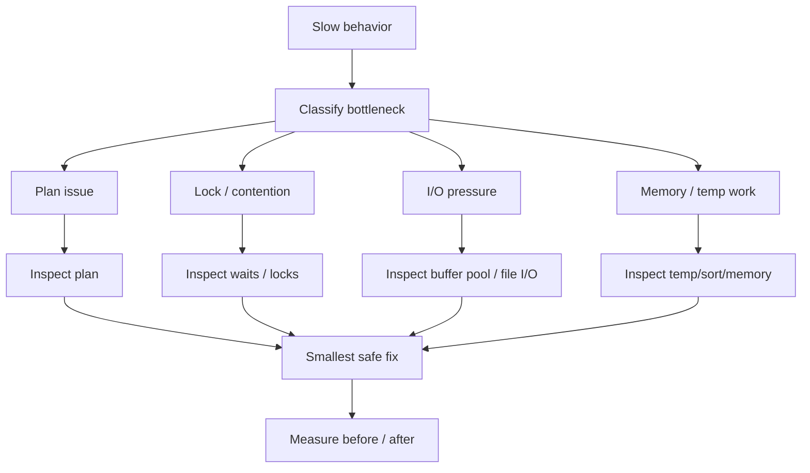

# Phase 5 — Performance Tuning (1 minute)

## Core idea
Performance tuning starts from symptoms, not from random tweaks.



## The essential chain

```text
slow behavior appears
  -> identify bottleneck class
  -> CPU, I/O, locks, memory, or bad plan?
  -> inspect evidence
  -> change the smallest safe thing
  -> verify before/after
```

## Minimal vocabulary
- **bottleneck** = dominant limiting factor
- **slow query analysis** = understanding why a query is slow in context
- **anti-pattern** = query/schema/use pattern that predictably causes bad performance
- **covering index** = can remove extra lookup work
- **filesort / temp table** = extra work caused by plan/query shape

## Production meaning
This phase is where internals become operational skill.
It explains how to move from:
- “the app is slow”

to:
- “this is likely a lock wait problem, not an index problem”

## Done when
You can explain:
1. why tuning must start with diagnosis
2. how to separate plan issues from contention issues
3. why safe tuning means measuring before and after
4. why many bad queries come from recurring anti-patterns
