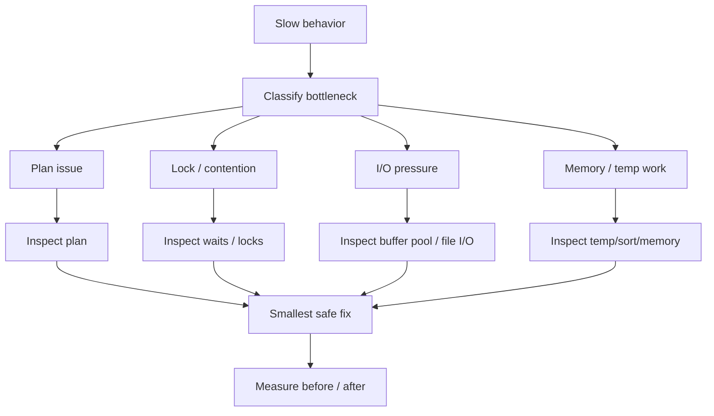

# Phase 5 — Performance Tuning (5 minutes)



## The first-principles question

> When the system is slow, how do we know what to change without guessing blindly?

## Start from the reality
“Slow” is not a root cause.
It is a symptom.

The real question is always:
- what is the dominant bottleneck?

Possible classes:
- bad plan
- too much I/O
- lock contention
- CPU-heavy execution
- memory pressure
- excessive sort/temp work

---

## 1. Diagnosis before tuning
Good tuning starts like this:

```text
symptom
  -> mechanism hypothesis
  -> evidence
  -> smallest safe change
  -> verify result
```

Bad tuning starts like this:
- add random index
- tweak config blindly
- rewrite SQL without understanding bottleneck

---

## 2. Query-level diagnosis
When a specific query is slow, useful questions are:
- is the chosen plan bad?
- are row estimates wrong?
- is it scanning too much?
- is it sorting or building temp tables?
- is it doing too many bookmark lookups?

This is where:
- EXPLAIN ANALYZE
- sys/performance schema views
- slow query log

start to matter together.

---

## 3. Anti-pattern thinking
Many performance issues come from recurring patterns:
- non-sargable predicates
- correlated subqueries
- OR conditions across columns
- wide range updates
- indexes that do not match query shape

So tuning is often about removing predictable waste, not heroic magic.

---

## 4. Safe tuning
A good fix should be tied to a clear mechanism.

Examples:
- add/adjust index because plan shows too much row examination
- rewrite query because function on indexed column prevents index use
- shrink transaction scope because waits show contention, not scan cost

This is safer than “tune everything at once”.

---

## Production meaning
This phase is what turns internals into operational leverage.
It teaches how to map:
- slow endpoint
- slow query digest
- lock waits
- high I/O
- poor plan

into distinct response paths.

---

## Mental model to keep

```text
slow system
  -> classify bottleneck
  -> inspect evidence
  -> choose smallest justified intervention
  -> compare before/after
```

## If you remember 4 things
1. “Slow” is a symptom, not a diagnosis.
2. Tuning starts with bottleneck classification.
3. Many wins come from removing recurring anti-patterns.
4. Measure before and after every significant change.
