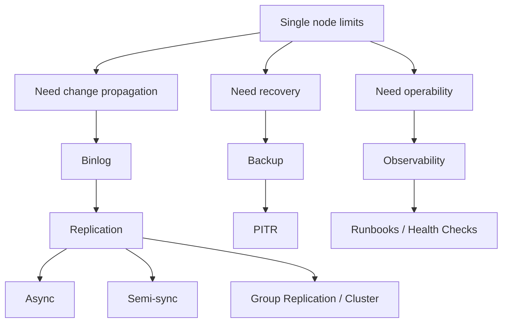

# Phase 6 — Replication / HA / Operations

> A single server is not enough. How do changes propagate, how do failures get handled, and how do we operate MySQL safely?

## Core question
- Why does binlog exist if redo log already exists?
- How does replication trade speed for safety?
- Why is replication not backup?
- What should we inspect first in a production incident?

## Focus
- binary log
- GTID
- replication modes
- failover semantics
- backup / PITR
- observability
- health check runbooks

## Knowledge model

## Primary reading
- Cross-cutting reference: `../production-symptom-map.md`
- Canonical sequence: `../roadmap-v2.md`

## Expected outputs
- explain redo log vs binlog clearly
- explain async vs semi-sync vs group replication trade-offs
- describe a sane backup/PITR strategy
- walk a production health-check path systematically

## Lab prompts
- inspect binlog basics
- review replication-related variables and status tables
- practice a simple backup/restore + PITR mental workflow

## Reading ladder
- `read-1min.md`
- `read-5min.md`
- `read-10min.md`
- `read-full.md`

## Production bridge
Typical symptoms mapped here:
- replica lag
- failover data loss questions
- slow apply / operational backlog
- weak observability during incidents
