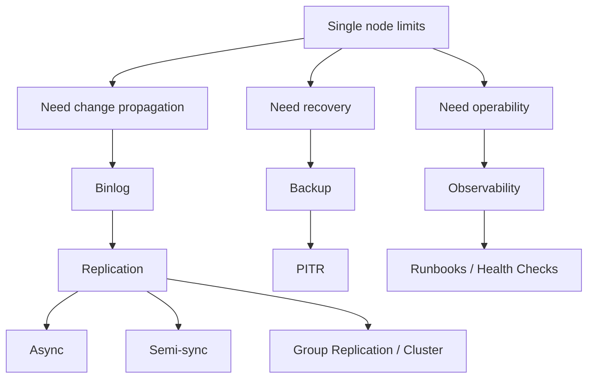

# Phase 6 — Replication / HA / Operations (1 minute)

## Core idea
One MySQL server is not enough for scale, failover, backup, and operational safety.



## The essential chain

```text
single server has limits
  -> need change propagation
  -> binary log + replication
  -> need failover safety
  -> HA strategy
  -> need recovery from mistakes/disaster
  -> backup + PITR
  -> need visibility during incidents
  -> observability + runbooks
```

## Minimal vocabulary
- **binlog** = change stream for replication and PITR
- **GTID** = global transaction identity for replication positioning
- **replication lag** = replica is behind source
- **semi-sync** = source waits for replica ACK before considering transaction safe enough
- **PITR** = point-in-time recovery
- **replication is not backup** = replicated mistakes are still mistakes

## Production meaning
This phase explains:
- why redo log is not enough for replication
- how failover can lose data or avoid losing it depending on topology
- why backup strategy is separate from replication
- how to think during MySQL production incidents

## Done when
You can explain:
1. redo log vs binlog
2. async vs semi-sync trade-offs
3. why replication is not backup
4. what a sane health-check path looks like during an incident
