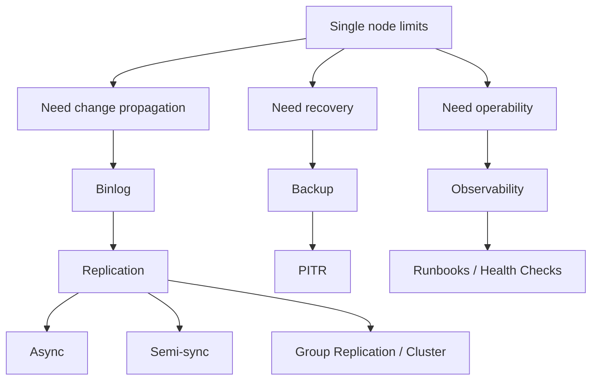

# Phase 6 — Replication / HA / Operations (5 minutes)



## The first-principles question

> A single MySQL server will eventually fail, saturate, or be operated incorrectly. How do we keep data available, recoverable, and observable?

## Start from the problem
A single server creates several risks:
- no read scaling
- single point of failure
- no clean failover path
- weak disaster recovery if storage or humans fail

So production MySQL needs more than one box.

---

## 1. Binary log
Redo log is for local crash recovery.
But replicas need a change stream they can consume.

That is the **binary log**.

It is the basis for:
- replication
- point-in-time recovery
- operational change propagation

---

## 2. Replication
Replication means another server replays changes from the source.

Important modes:
- **async**: fastest, but source can fail before replica catches up
- **semi-sync**: source waits for replica ACK, safer but slower

This is a classic speed vs safety trade-off.

---

## 3. HA and failover
Replication alone does not solve availability.
You still need:
- promotion rules
- failover mechanism
- clarity on what data may be lost during failover

That is why HA is more than “we have a replica”.

---

## 4. Backup and PITR
Replication copies changes.
It does not protect against:
- bad DELETE
- DROP TABLE
- corrupted logical state

That is why replication is not backup.

You still need:
- full/incremental backup strategy
- binlog retention
- PITR process

---

## 5. Operations and observability
When production is unhealthy, you need a disciplined path:
- check connections
- check replication health
- check lag
- check top statements
- check locks / I/O / memory pressure
- know whether recovery/failover is required

---

## Production meaning
This phase turns MySQL from “single-node internals knowledge” into “operable production system understanding”.

---

## Mental model to keep

```text
binlog for propagation
  + replication for copies
  + HA strategy for failover
  + backup/PITR for recovery
  + observability for operations
```

## If you remember 4 things
1. Redo log and binlog solve different problems.
2. Async and semi-sync trade safety for latency differently.
3. Replication is not backup.
4. Operations need a runbook, not improvisation.
