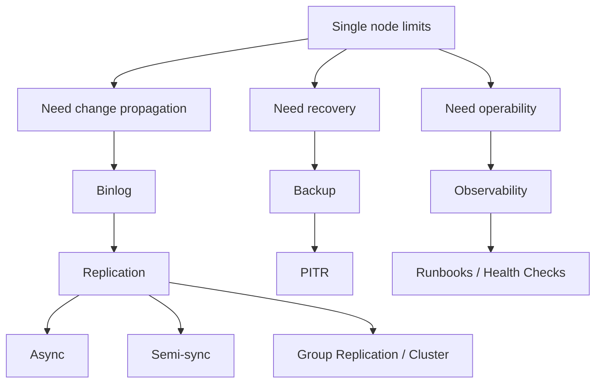

# Phase 6 — Replication / HA / Operations (Full)



## 1. Why this phase exists

So far, the roadmap can explain how a single MySQL server stores data, handles concurrency, survives crashes, and chooses plans.

But real production systems need more than a strong single node.
They need:
- additional copies of data
- failover behavior
- recovery from operator and application mistakes
- operational visibility under stress

This is why the final phase is not just “replication features”.
It is about running MySQL as a production system.

---

## 2. One server has multiple kinds of limits

A single server has at least four categories of limitation:

### Capacity
There is only so much read/write load one node can handle.

### Availability
If the node dies, service may stop.

### Recoverability
If bad data is written or deleted, a second copy that replicated the same mistake does not solve the problem.

### Observability
Without good operational visibility, you cannot diagnose or respond safely.

This is why production MySQL needs more than “good single-node tuning”.

---

## 3. Binlog vs redo log: different purposes

This distinction is one of the most important in MySQL architecture.

### Redo log
- local to the server
- used for crash recovery
- protects committed changes until data files catch up

### Binary log
- logical/ordered change stream for propagation
- used for replication and point-in-time recovery
- survives beyond single-node recovery concerns

The two logs exist because they solve different problems.

A useful shorthand:

```text
redo log = survive local crash
binlog = propagate and replay changes across systems/time
```

---

## 4. Replication: making copies of change

Replication means another MySQL server consumes the source’s changes and applies them.

This helps with:
- read scaling
- failover candidates
- operational flexibility

But replication is not one thing.
Different modes provide different trade-offs.

### Async replication
The source commits without waiting for the replica to fully guarantee receipt/apply.

Benefits:
- lower latency
- simpler operationally

Costs:
- if source fails, newest transactions may be missing on the replica

### Semi-sync replication
The source waits for at least one replica acknowledgment before treating the transaction as safe enough.

Benefits:
- stronger failover safety

Costs:
- extra latency
- still not infinite guarantees; exact semantics matter

This is why topology choice is a business decision expressed through infrastructure.

---

## 5. Replication lag is an architectural fact

Replicas are not necessarily up-to-the-instant mirrors.
They can lag.

Lag may come from:
- network delay
- slow replica apply
- large transactions
- hardware mismatch
- insufficient parallel apply

This matters because application behavior depends on it.
If an app writes to primary and immediately reads from a lagging replica, it may see stale data.

So replica usage must be aligned with consistency expectations.

This is not just an infra detail.
It is system-design behavior.

---

## 6. HA is more than “we have replicas”

A replica existing does not automatically give you high availability.

HA requires answers to questions like:
- who is promoted when primary fails?
- how is split-brain avoided?
- how are clients rerouted?
- what write-loss window is acceptable?
- how much automation is safe?

This is why technologies like Group Replication, InnoDB Cluster, and MySQL Router matter.
They are attempts to turn ad-hoc replication into a managed availability story.

But the deeper lesson is:

> HA is about failover semantics, not just extra copies

---

## 7. Backup and PITR: true recovery, not just duplication

A replica faithfully reproduces source changes.
That includes bad changes.

If someone drops a table on the primary, replication will happily spread that mistake.
So replication cannot be your only recovery strategy.

That is why backups exist.

Backups give you historical restore points.
Binlogs let you move forward from a restore point to a precise recovery target.
This is point-in-time recovery.

So a real recovery story usually needs:
- base backup
- binlog retention
- known restore process
- tested recovery drill

Without testing, a backup is only a hopeful artifact.

---

## 8. Operations: making the system diagnosable

Production systems fail in confusing ways.
When MySQL is unhealthy, you need a disciplined diagnostic path.

Examples:
- are connections exhausted?
- is lag increasing?
- are queries regressing?
- is lock contention dominating?
- is I/O saturated?
- is failover required or not?

This is why observability and runbooks matter.

An operable system is not only well designed.
It is also understandable under incident pressure.

---

## 9. Typical production thinking for this phase

This phase should change how you think about architecture.

### Read scaling
Replica reads are not free if the business expects immediate consistency.

### Failover
Failover safety depends on replication guarantees and promotion policy.

### Recovery objectives
Backups are only meaningful in terms of restore path and acceptable data loss/time-to-restore.

### Incident management
Observability must support a fast path from symptom to decision.

This is why replication/HA/ops belongs inside solution architecture knowledge.

---

## 10. Common misconceptions this phase fixes

### “Replication means no data loss on failover”
False.
Depends on mode and timing.

### “Having replicas means we have backup”
False.
Replicas duplicate mistakes.

### “Redo log already has changes, so that should be enough for replicas”
False.
Redo and binlog solve different classes of problem.

### “If we can restore a backup file, we are safe”
Incomplete.
You need tested PITR and operational readiness.

---

## 11. Suggested labs for this phase

### Lab 1 — binlog identity
- inspect binlog basics
- explain what it captures and why redo cannot replace it

### Lab 2 — replication trade-off thought experiment
- compare async vs semi-sync in terms of failover loss window and latency

### Lab 3 — stale-read scenario
- reason through app write to primary, read from replica
- explain how lag changes user-visible behavior

### Lab 4 — backup vs replication scenario
- imagine accidental delete replicated everywhere
- explain why only backup + PITR can recover correctly

### Lab 5 — incident runbook design
- define a sequence for checking health:
  1. connectivity / connections
  2. replication status / lag
  3. top statements
  4. locks / waits
  5. I/O / memory
  6. recovery/failover decision

---

## 12. Production symptom maps

### Symptom: stale reads after writes
Likely cause:
- replica lag plus read routing to replica

### Symptom: recent transactions vanished after failover
Likely cause:
- async replication topology and primary failure before replica caught up

### Symptom: restore exists but business confidence is low
Likely cause:
- recovery never tested end-to-end
- binlog retention and restore points not aligned

### Symptom: incident response is improvisation
Likely cause:
- no runbook
- no operational decision sequence
- poor observability integration

---

## 13. Compact mental model

Keep this chain:

```text
single node has limits
  -> binlog propagates changes
  -> replication creates additional copies
  -> HA defines failover behavior and safety
  -> backups + PITR provide true recovery
  -> observability + runbooks make incidents manageable
```

---

## 14. Explain-back checklist

You should be able to explain:
1. why redo log and binlog exist separately
2. why replication lag matters to application correctness
3. why HA requires explicit failover semantics
4. why replication is not backup
5. why PITR depends on both restore point and binlog continuity
6. why observability and runbooks are core to operating MySQL safely

If you can explain these clearly, the roadmap has reached a real production-systems level.
