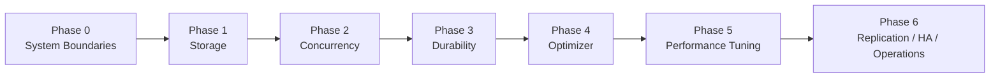

# MySQL Internals Roadmap v2

A first-principles roadmap shaped for backend production reality and architect-level understanding.

## Sequence

```text
0. System boundaries
1. Storage
2. Concurrency
3. Durability
4. Optimizer
5. Performance tuning
6. Replication / HA / Operations
```

## Why this sequence

```text
What is the system?
  -> How is data stored?
    -> How do many users use it safely?
      -> How does it survive crashes?
        -> How does it choose execution plans?
          -> How do we diagnose and tune?
            -> How do we run it safely at scale?
```

## Roadmap diagram



## Phase map

### Phase 0 — System Boundaries
- mysqld process
- SQL layer vs storage engine
- handler API
- client protocol
- query execution flow
- thread model

### Phase 1 — Storage
- pages
- buffer pool
- B+ tree
- clustered vs secondary index
- bookmark lookup
- page split/merge

### Phase 2 — Concurrency
- transactions
- isolation levels
- MVCC
- undo log
- read view
- record/gap/next-key lock
- deadlock
- long transaction impact

### Phase 3 — Durability
- WAL
- redo log
- log buffer
- LSN
- checkpoint
- doublewrite
- crash recovery

### Phase 4 — Optimizer
- statistics and cardinality
- cost model
- join order
- access path selection
- EXPLAIN / EXPLAIN ANALYZE
- optimizer trace

### Phase 5 — Performance Tuning
- slow query diagnosis
- latency decomposition
- CPU vs I/O vs lock wait
- anti-patterns
- workload-aware tuning
- safe index and SQL tuning

### Phase 6 — Replication / HA / Operations
- binary log
- GTID
- replication modes
- failover semantics
- backup / PITR
- observability
- production health checks

## Definition of done
A phase is done only when all four are true:
1. explain-back: can explain mechanism from first principles
2. lab: can reproduce or observe the mechanism in lab
3. production mapping: can connect it to real production symptoms
4. decision skill: can use it to make architecture/tuning decisions

## Cross-cutting tracks
- production symptom map
- explain-back checkpoints
- Java/backend mapping
- cheatsheet / mental model refresh

## Suggested usage
- Read this file first.
- Then use the phase README for the current phase.
- Use `production-symptom-map.md` and `cheatsheet.md` as recurring references.
