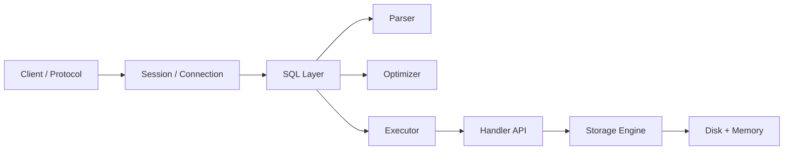

# Phase 0 — Ranh giới hệ thống

> Trước khi tối ưu bất cứ thứ gì, cần hiểu hệ thống này là gì và ranh giới của nó nằm ở đâu.

## Câu hỏi cốt lõi
- `mysqld` thực sự chịu trách nhiệm phần nào?
- SQL processing dừng ở đâu và trách nhiệm của storage engine bắt đầu từ đâu?
- Một query đi từ client xuống disk theo đường nào?

## Trọng tâm
- kiến trúc server
- client protocol
- thread model
- luồng thực thi query
- handler API
- InnoDB vs MyISAM ở góc nhìn hệ thống

## Mô hình kiến thức

## Tài liệu chính
- Trình tự chuẩn: `../roadmap-v2.md`
- Khung tư duy first-principles: `../first-principles-learning.md`

## Kết quả mong đợi
- tự vẽ lại được đường đi end-to-end của query
- giải thích rõ server layer khác engine layer thế nào
- giải thích vì sao handler API tồn tại

## Gợi ý lab
- kết nối MySQL lab và kiểm tra các thông tin process / config cơ bản
- lần theo một query đơn từ parser xuống engine ở mức khái niệm

## Bậc thang đọc
- `read-1min.md`
- `read-5min.md`
- `read-10min.md`
- `read-full.md`

## Cầu nối sang production
Những câu hỏi phase này giúp trả lời:
- vấn đề có khả năng nằm ở protocol, SQL layer, engine hay storage?
- lỗi nào thuộc app connection pool, lỗi nào thuộc MySQL internals?
