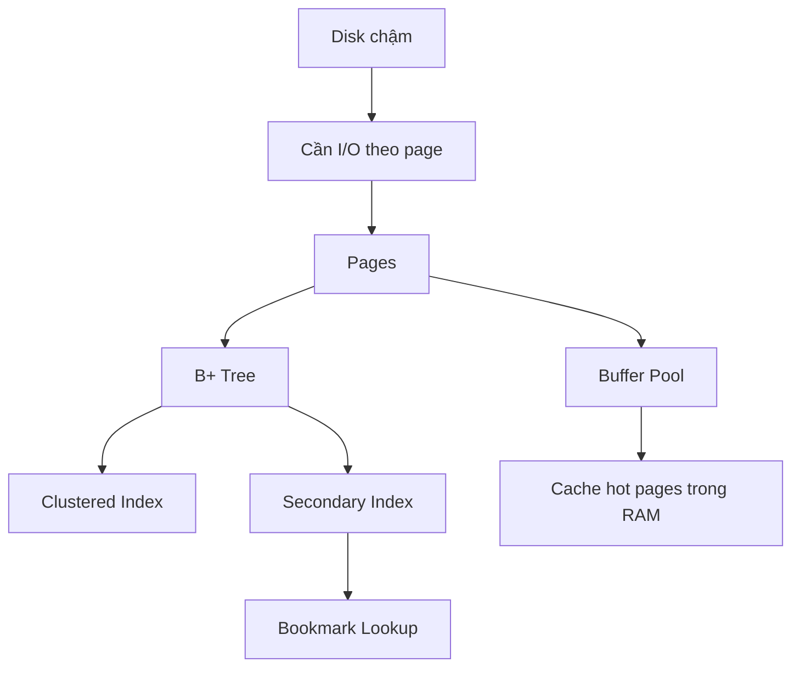

# Phase 1 — Lưu trữ

> Disk chậm, RAM nhanh. MySQL tổ chức dữ liệu thế nào để đọc/ghi còn thực tế?

## Câu hỏi cốt lõi
- Vì sao cần page?
- Vì sao cần buffer pool?
- Vì sao cần B+ tree?
- Vì sao có clustered index và secondary index?

## Trọng tâm
- page I/O
- buffer pool
- trực giác về dirty page và flushing
- B+ tree
- clustered index
- secondary index
- bookmark lookup
- page split / merge

## Mô hình kiến thức

## Tài liệu chính
- Trình tự chuẩn: `../roadmap-v2.md`
- Cheatsheet: `../cheatsheet.md`

## Kết quả mong đợi
- giải thích vì sao node = page là một lựa chọn thiết kế rất mạnh
- giải thích full đường đi của secondary index lookup
- dự đoán khi nào query có khả năng gây random I/O nhiều hơn

## Gợi ý lab
- so sánh PK lookup với secondary index lookup
- kiểm tra các metric liên quan index và buffer pool
- quan sát hành vi page/index qua EXPLAIN và stats

## Bậc thang đọc
- `read-1min.md`
- `read-5min.md`
- `read-10min.md`
- `read-full.md`

## Cầu nối sang production
Các symptom thường map về đây:
- read latency cao do access path kém
- quá nhiều scan
- memory pressure vì buffer pool quá nhỏ
- I/O dư thừa do thiết kế index kém
