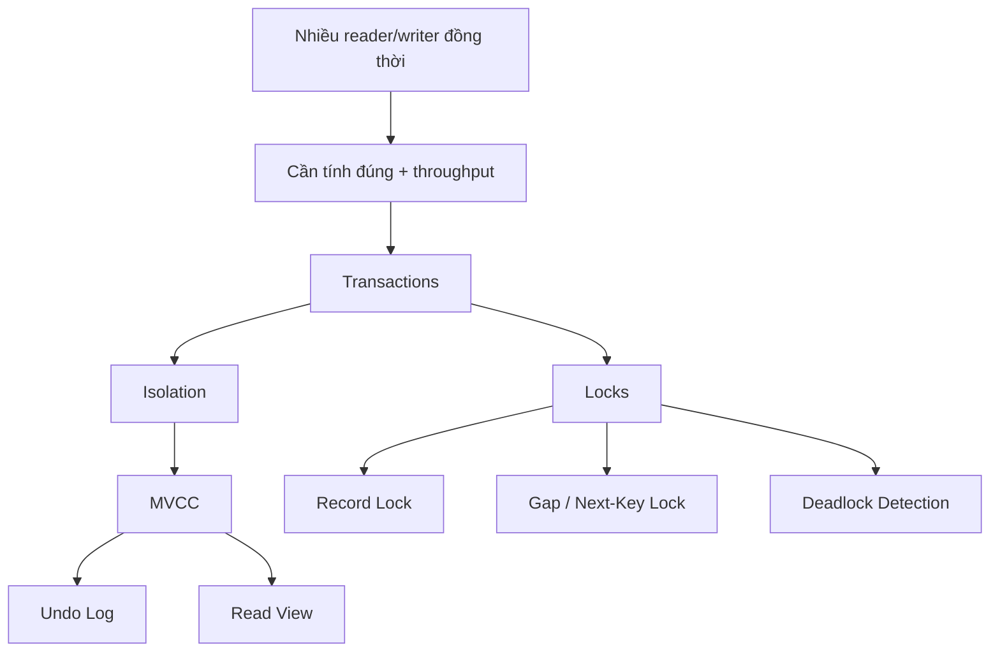

# Phase 2 — Đồng thời

> Nhiều người dùng cùng chạm vào một dữ liệu. MySQL giữ tính đúng đắn thế nào mà không làm throughput sụp đổ?

## Câu hỏi cốt lõi
- Reader và writer cùng tồn tại thế nào?
- Vì sao MVCC tồn tại?
- Vì sao cần các version cũ?
- Vì sao gap/next-key lock tồn tại?

## Trọng tâm
- vòng đời transaction
- isolation levels
- MVCC
- undo log
- read view
- consistent read
- record lock
- gap lock
- next-key lock
- deadlock detection
- tác động của long transaction

## Mô hình kiến thức

## Tài liệu chính
- Trình tự chuẩn và khung first-principles: `../roadmap-v2.md`, `../first-principles-learning.md`
- Phase này là trụ cột mới được tách rõ trong v2 và nên được phát triển như một content track riêng.
- Để tăng trực giác, có thể tái dùng các tài liệu storage/durability khi chúng đụng tới tương tác giữa undo/redo/read view.

## Kết quả mong đợi
- giải thích MVCC mà không dùng buzzword sáo rỗng
- so sánh repeatable read với read committed theo cách thực dụng
- giải thích vì sao deadlock là chuyện bình thường, không phải ngoại lệ

## Gợi ý lab
- mở 2-3 session để tái hiện lock wait / deadlock
- kiểm tra `SHOW ENGINE INNODB STATUS`
- so sánh snapshot read với locking read

## Cầu nối sang production
Các symptom thường map về đây:
- deadlock storms
- tăng vọt lock wait timeout
- throughput sụp đổ khi write contention cao
- purge lag / tác dụng phụ từ long transaction

## Bậc thang đọc
- `read-1min.md`
- `read-5min.md`
- `read-10min.md`
- `read-full.md`

## Ghi chú
Repo trước đây chưa nhấn mạnh đủ concurrency như một phase cấp cao. Trong roadmap v2, nó là một trụ cột hạng nhất.
