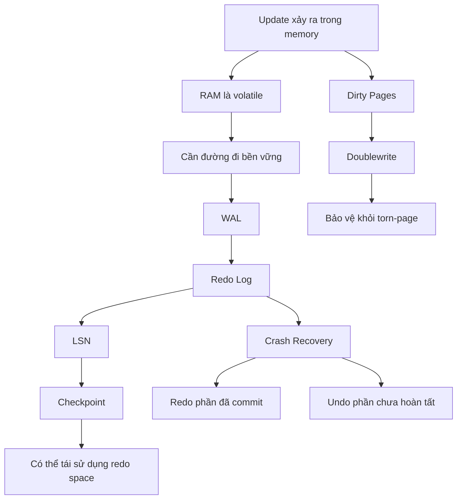

# Phase 3 — Độ bền dữ liệu

> Commit nghĩa là một thứ gì đó đã sống sót qua crash. Cụ thể cái gì sống sót, và vì sao?

## Câu hỏi cốt lõi
- COMMIT thật sự nghĩa là gì ở mức disk?
- Vì sao cần WAL?
- Vì sao dùng redo log thay vì flush data page ở mọi commit?
- Vì sao cần checkpoint và doublewrite?

## Trọng tâm
- WAL
- redo log
- log buffer
- LSN
- checkpoint
- doublewrite buffer
- luồng crash recovery

## Mô hình kiến thức

## Tài liệu chính
- Trình tự chuẩn: `../roadmap-v2.md`
- Cheatsheet: `../cheatsheet.md`

## Kết quả mong đợi
- giải thích write path từ memory tới durable commit
- giải thích vì sao redo log và flush data page được tách rời
- giải thích recovery sau crash ở nhiều điểm khác nhau trong write lifecycle

## Gợi ý lab
- thực hiện ghi dữ liệu rồi kiểm tra redo/checkpoint state
- kill/restart lab để suy luận về recovery
- so sánh các thiết lập durability của transaction ở mức khái niệm

## Bậc thang đọc
- `read-1min.md`
- `read-5min.md`
- `read-10min.md`
- `read-full.md`

## Cầu nối sang production
Các symptom thường map về đây:
- commit latency tăng vọt
- recovery quá lâu sau crash
- checkpoint pressure
- redo saturation / flush pressure
