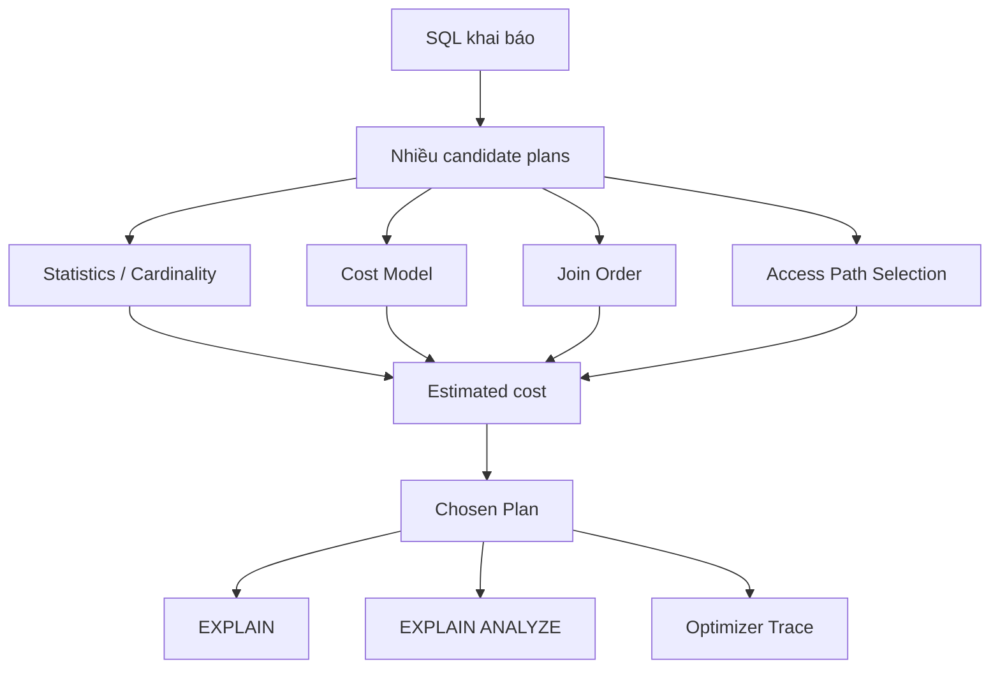

# Phase 4 — Optimizer

> Một query có thể có rất nhiều kế hoạch chạy. MySQL chọn một kế hoạch bằng cách nào?

## Câu hỏi cốt lõi
- Có những candidate plan nào?
- Cost model dẫn dắt việc chọn plan thế nào?
- Vì sao statistics cũ tạo ra bad plan?
- Khi nào nên kiểm tra optimizer trước khi tune mù quáng?

## Trọng tâm
- statistics và cardinality
- cost model
- join order
- chọn access path
- optimizer trace
- EXPLAIN và EXPLAIN ANALYZE

## Mô hình kiến thức

## Tài liệu chính
- Trình tự chuẩn: `../roadmap-v2.md`

## Kết quả mong đợi
- đọc execution plan với sự tự tin
- dự đoán khi nào optimizer có thể chọn sai
- giải thích cost và cardinality tương tác với nhau ra sao

## Gợi ý lab
- so sánh plan dưới các phân bố dữ liệu khác nhau
- kiểm tra optimizer trace
- so sánh estimated rows với actual rows

## Bậc thang đọc
- `read-1min.md`
- `read-5min.md`
- `read-10min.md`
- `read-full.md`

## Cầu nối sang production
Các symptom thường map về đây:
- query latency thiếu ổn định do plan thay đổi
- regression sau khi schema hoặc data distribution đổi
- sai join order / full scan do estimate kém
