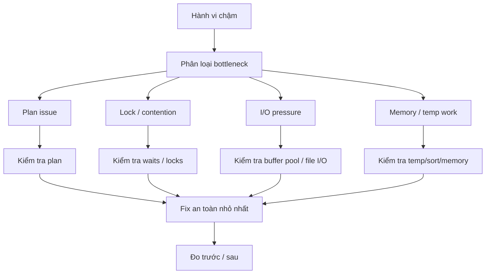

# Phase 5 — Tối ưu hiệu năng

> Khi hệ thống chậm, làm sao chẩn đoán đúng trước khi tối ưu?

## Câu hỏi cốt lõi
- Chậm là do CPU, I/O, locking, memory hay một bad plan?
- Fix nào an toàn, fix nào chỉ là cargo-cult tuning?

## Trọng tâm
- hành vi thực thi trong thực tế
- workflow chẩn đoán hiệu năng
- phân tích slow query
- anti-patterns
- trade-off của index
- tuning theo workload
- thói quen rewrite SQL và tuning an toàn

## Mô hình kiến thức

## Tài liệu chính
- Tài liệu cắt ngang: `../production-symptom-map.md`
- Trình tự chuẩn: `../roadmap-v2.md`

## Kết quả mong đợi
- map được symptom -> mechanism -> signal -> action
- phân biệt optimizer problem với contention problem
- tune bằng evidence, không tune bằng mê tín

## Gợi ý lab
- so sánh before/after cho các query tệ
- kiểm tra slow query log và các view trong sys/performance schema
- thử một số anti-pattern và các bản rewrite tương ứng

## Bậc thang đọc
- `read-1min.md`
- `read-5min.md`
- `read-10min.md`
- `read-full.md`

## Cầu nối sang production
Các symptom thường map về đây:
- endpoint chậm lúc có lúc không
- full table scan trên hot path
- filesort/temp table quá nhiều
- index bloat do tune quá tay
