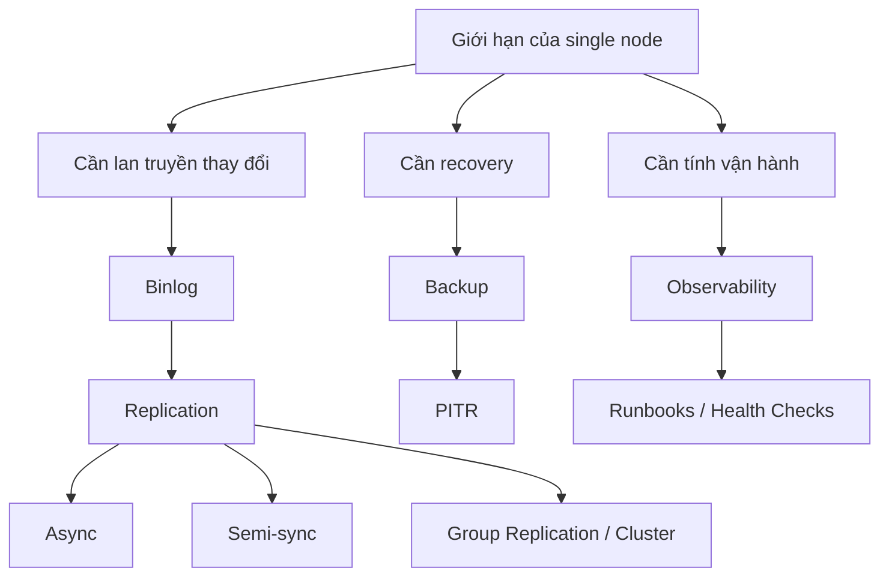

# Phase 6 — Replication / HA / Vận hành

> Một server đơn là không đủ. Thay đổi được lan truyền thế nào, lỗi được xử lý thế nào, và ta vận hành MySQL an toàn ra sao?

## Câu hỏi cốt lõi
- Vì sao đã có redo log mà vẫn cần binlog?
- Replication đánh đổi tốc độ lấy độ an toàn ra sao?
- Vì sao replication không phải backup?
- Trong một sự cố production, nên kiểm tra gì đầu tiên?

## Trọng tâm
- binary log
- GTID
- các mode replication
- ngữ nghĩa failover
- backup / PITR
- observability
- health check runbooks

## Mô hình kiến thức

## Tài liệu chính
- Tài liệu cắt ngang: `../production-symptom-map.md`
- Trình tự chuẩn: `../roadmap-v2.md`

## Kết quả mong đợi
- giải thích rõ redo log khác binlog thế nào
- giải thích trade-off giữa async, semi-sync và group replication
- mô tả được một chiến lược backup/PITR hợp lý
- đi được một health-check path production theo cách có hệ thống

## Gợi ý lab
- kiểm tra những điều cơ bản của binlog
- xem các variables và status tables liên quan replication
- luyện một workflow tư duy đơn giản cho backup/restore + PITR

## Bậc thang đọc
- `read-1min.md`
- `read-5min.md`
- `read-10min.md`
- `read-full.md`

## Cầu nối sang production
Các symptom thường map về đây:
- replica lag
- câu hỏi về mất dữ liệu khi failover
- slow apply / backlog vận hành
- observability yếu trong incident
